# Command Line Interface (CLI)

The ``hdwallet`` command serves as the main entry point for interacting with the HDWallet CLI.
It allows users to manage Hierarchical Deterministic (HD) Wallet, enabling key generation, wallet inspection, 
and data dumping in a secure and user-friendly manner.



### Help

```
hdwallet --help
```

<details open>
  <summary>Output</summary><br/>

```shell
Usage: hdwallet [OPTIONS] COMMAND [ARGS]...

Options:
  -v, --version  Show HDWallet version and exit
  -h, --help     Show this message and exit.

Commands:
  dump (d)      Select Dump hdwallet keys
  dumps (ds)    Select Dumps hdwallet keys
  generate (g)  Select Generate for HDWallet
  list (l)      Select List for HDWallet information
```
</details>

### Version

```
hdwallet --version
```

<details open>
  <summary>Output</summary><br/>

```shell
v3.0.0
```
</details>

## Generate Command

### Entropy

Generate entropy from strength number
```
hdwallet generate entropy --client BIP39 --strength 160
```
alias
```
hdwallet g e -c BIP39 -sym 160
```

<details open>
  <summary>Output</summary><br/>

```json5
{
    "client": "BIP39",
    "entropy": "10ad31cfb2860b312f0911fc9de22d836ca3eb14",
    "strength": 160
}
```
</details>


### Mnemonic

Generate mnemonic from words number
```
hdwallet generate mnemonic --client BIP39 --words 15 --language russian
```
alias
```
hdwallet g m -c BIP39 -w 15 -l russian
```

<details open>
  <summary>Output</summary><br/>

```json5
{
    "client": "BIP39",
    "mnemonic": "шкура практика овраг замок реклама мирный факт пятьсот намерен свитер паутина спальня жуткий вальс спешить",
    "language": "Russian",
    "words": 15
}
```
</details>

Generate mnemonic from entropy hex string
```
hdwallet generate mnemonic --client BIP39 --entropy 10ad31cfb2860b312f0911fc9de22d836ca3eb14 --language english
```
alias
```
hdwallet g m -c BIP39 -e 10ad31cfb2860b312f0911fc9de22d836ca3eb14 -l english
```

<details open>
  <summary>Output</summary><br/>

```json5
{
    "client": "BIP39",
    "mnemonic": "awful hat initial govern gaze obtain rotate captain wish upper merge almost sketch void face",
    "language": "English",
    "words": 15
}
```
</details>

### Seed

Generate seed from mnemonic words
```
hdwallet generate seed --client BIP39 --passphrase meherett --mnemonic "awful hat initial govern gaze obtain rotate captain wish upper merge almost sketch void face"
```
alias
```
hdwallet g s -c BIP39 -p meherett -m "awful hat initial govern gaze obtain rotate captain wish upper merge almost sketch void face"
```

<details open>
  <summary>Output</summary><br/>

```json5
{
    "client": "BIP39",
    "seed": "e7bc9f2abb0827137b408c10d9942066a1f2f356d1cda46f6c0dd5fbc2f7c996328100e580adc26ac614de68644bec61e885afd03dc74eade545fd53b1312cdb"
}
```
</details>

## Dump Command

### BIP32 Hierarchical Deterministic (HD) 

```
hdwallet dump --symbol BTC --hd BIP32 --entropy 10ad31cfb2860b312f0911fc9de22d836ca3eb14 --derivation Custom --path "m/524'/489'"
```
alias
```
hdwallet d -sym BTC -h BIP32 -e 10ad31cfb2860b312f0911fc9de22d836ca3eb14 -d Custom -p "m/524'/489'"
```

<details>
  <summary>Output</summary><br/>

```json5
{
    "cryptocurrency": "Bitcoin",
    "symbol": "BTC",
    "network": "mainnet",
    "coin_type": 0,
    "entropy": "10ad31cfb2860b312f0911fc9de22d836ca3eb14",
    "strength": 160,
    "mnemonic": "awful hat initial govern gaze obtain rotate captain wish upper merge almost sketch void face",
    "passphrase": null,
    "language": "English",
    "seed": "480e2d3d35c1e41c32ee2e480705e16e5b95ade415831a2aff4db7b3b9a0f5b1257cc63c251b602d50fc88830050b893ab2eb2ef650accb1b9410567e6ba838d",
    "ecc": "SLIP10-Secp256k1",
    "hd": "BIP32",
    "semantic": "p2pkh",
    "root_xprivate_key": "xprv9s21ZrQH143K3q1UgUwmqf71gy5GQXjSg71YCHK1hFcZZXbnPNne5QKfybnKw9zUAB9cEAA5KSeHVVB9BfbgT3Nv1Kr2BVropBWtU5y6obs",
    "root_xpublic_key": "xpub661MyMwAqRbcGK5wnWUnCo3kEzukozTJ3Kw8zfidFb9YSKvvvv6tdCe9pthSrH6E7t5uDCBL94hjeMBtGo6oU99vTh5arnUXBGTmxhf7qs6",
    "root_private_key": "b3792687bea479018f971a287fc489e19041e63aa353b5c8997e8a501da00734",
    "root_wif": "L3Eans1Cre2zLMx9Nz2mtbqYKjTq5aD1JvcgjSamFf1BM4PW4y7Q",
    "root_chain_code": "b1c4808dc0d6c008978ebb0b727f74b7ba0a9cf91aa9585930aad68b23f5aad1",
    "root_public_key": "03abc5c947c486430ff88b039781f99b9542f2baf523685b23abbe77385c4b0628",
    "strict": true,
    "public_key_type": "compressed",
    "wif_type": "wif-compressed",
    "derivation": {
        "at": {
            "path": "m/524'/489'",
            "indexes": [
                2147484172,
                2147484137
            ],
            "depth": 2,
            "index": 2147484137
        },
        "xprivate_key": "xprv9wCoQbJHg43tVRT5TgD4nJ4au6SivuUxHRS5JufFqWzczt3bQv1RiYXjDkj23nE61DsZ5TXAWSWjodHmY88ELskPU7dx8Cn2HBxG7AKjJpU",
        "xpublic_key": "xpub6AC9p6qBWRcBhuXYZhk59S1KT8HDLNCoeeMg7J4sPrXbsgNjxTKgGLrD54cDQr7UvUiVV2xotgBeaUt2xC9rLEkHCvYn41paSTGLtgWzjb5",
        "private_key": "42d77adad487f5299dc5844e8387f87b13a3ceb26364dc57d4f83afbdbece495",
        "wif": "KyTeDSq9c59iwNvbLY6gYgxYEikQbcvvNX8CeM75NiMLQmu9SC8m",
        "chain_code": "2baaaecb40760f0db829fa2c4732644a478203419cb0d0825b573f4193533a65",
        "public_key": "03ba785426897b478ffdab95558fa9647acfe5ae62eece5a69166334ca0570ac04",
        "uncompressed": "04ba785426897b478ffdab95558fa9647acfe5ae62eece5a69166334ca0570ac04bb6b71697828f7ea5a06b34cb84177038b3ff964b82df6004f243e2ad0025f89",
        "compressed": "03ba785426897b478ffdab95558fa9647acfe5ae62eece5a69166334ca0570ac04",
        "hash": "70c0cba06fc101eec24ef59353258f4953d31826",
        "fingerprint": "70c0cba0",
        "parent_fingerprint": "3983ea20",
        "addresses": {
            "p2pkh": "1BHBe9SA5GEhfTYmmgBQwiij1LuqHeb1du",
            "p2sh": "35JtxbpwcMTT7ygAvyx7y9ybzm5ZbYFggQ",
            "p2tr": "bc1pv0rc9z7yrvtpn0nmramv8jsjlq0g2xm5lj4cmv6h29ekdl7mdteqdhplyu",
            "p2wpkh": "bc1qwrqvhgr0cyq7asjw7kf4xfv0f9faxxpxdps3za",
            "p2wpkh_in_p2sh": "3QuxL19SX1PvYVEvBgFUYjBLp66n831JDy",
            "p2wsh": "bc1qtpa3qxwwvuummcjwwarlwa7et7jj6g53hs9vpd2kajpfsy8m06ysgzym3z",
            "p2wsh_in_p2sh": "3N6XWYabbLVrDjCANxf3bYM8g43PdSLA5E"
        }
    }
}
```
</details>

### BIP44 Hierarchical Deterministic (HD) 

```
hdwallet dump --symbol ALGO --hd BIP44 --derivation BIP44 --entropy 10ad31cfb2860b312f0911fc9de22d836ca3eb14 --account 1
```
alias
```
hdwallet d -sym ALGO -h BIP44 -d BIP44 -e 10ad31cfb2860b312f0911fc9de22d836ca3eb14 -ac 1
```

<details>
  <summary>Output</summary><br/>

```json5
{
    "cryptocurrency": "Algorand",
    "symbol": "ALGO",
    "network": "mainnet",
    "coin_type": 283,
    "entropy": "10ad31cfb2860b312f0911fc9de22d836ca3eb14",
    "strength": 160,
    "mnemonic": "awful hat initial govern gaze obtain rotate captain wish upper merge almost sketch void face",
    "passphrase": null,
    "language": "English",
    "seed": "480e2d3d35c1e41c32ee2e480705e16e5b95ade415831a2aff4db7b3b9a0f5b1257cc63c251b602d50fc88830050b893ab2eb2ef650accb1b9410567e6ba838d",
    "ecc": "SLIP10-Ed25519",
    "hd": "BIP44",
    "semantic": "p2pkh",
    "root_xprivate_key": "xprv9s21ZrQH143K2ToS32WUpnH2nrCiRTm8M9Jx9dfMapx3fvDXJFvnHHKbcvY6M5KwLZE4rtDrZT8AqYCefHJNdovFyJ2pKhLJvuKnUmu3fiV",
    "root_xpublic_key": "xpub661MyMwAqRbcEwsu943VBvDmLt3CpvUyiNEYx24y9AV2YiYfqoF2q5e5U7REZQ5qLTVfRSL8hNDRa2q3j3oGA9cvTEs53JU2E1uH7UVuYLa",
    "root_private_key": "c4556dd571269b90010520ae06f60b57c44bddf01e0a82051e3ac04148fad8f3",
    "root_wif": "L3oMiQSQGuhkjCduZbQNLpbFVoE7sjBe34dKwtnutm5H6ECXNYTm",
    "root_chain_code": "2899790d6f0501b23d28e4711b9c88a7d1da7210257d93ef0ce5f8cdcad77643",
    "root_public_key": "00a1f74c4b857023038499b4d3d4fcc7c1c0756c3a6114664f11a04e73c369c130",
    "strict": true,
    "public_key_type": "compressed",
    "wif_type": "wif-compressed",
    "derivation": {
        "at": {
            "path": "m/44'/283'/1'/0/0",
            "indexes": [
                2147483692,
                2147483931,
                2147483649,
                0,
                0
            ],
            "depth": 5,
            "purpose": 44,
            "coin_type": 283,
            "account": 1,
            "change": "external-chain",
            "address": 0
        },
        "xprivate_key": "xprvA3TF81pZrbzz3mkCfiqdr3sgoukopx9gZ23SqknNCcLKZrhfiapahNNHZptJmPnrbcEC2qWRBjSryANF2eLsrrnaQEsXvBhiudEfi6krvH7",
        "xpublic_key": "xpub6GSbXXMTgyZHGFpfmkNeDBpRMwbJEQsXvEy3e9BykwsJSf2pG88qFAgmR2Ka1vRjnXniuw5C7MBgAuyw9EaLtwrF89wrCkCPr5AvMYoigLv",
        "private_key": "1cb6a834f04514fc4a383006e0a0f2162c5583e6633fd516ce5480175786456d",
        "wif": "KxBXUKvNu1hZuXUaTYbpuQHdWxBZMwq8nHvpF8kb7jCQ4ChT1uKp",
        "chain_code": "657428446ca43863a75c9d3e010277dca90da070395322ab22789119e2f4420f",
        "public_key": "004347ffe458c1172552450093b7aae21143b852d2e10c3ddb424b8d201e32f4ee",
        "uncompressed": "004347ffe458c1172552450093b7aae21143b852d2e10c3ddb424b8d201e32f4ee",
        "compressed": "004347ffe458c1172552450093b7aae21143b852d2e10c3ddb424b8d201e32f4ee",
        "hash": "7ed941734af30a7df90c6e3d2c6db3db55d98d23",
        "fingerprint": "7ed94173",
        "parent_fingerprint": "8bb39b38",
        "address": "IND77ZCYYELSKUSFACJ3PKXCCFB3QUWS4EGD3W2CJOGSAHRS6TXAUFAZ4I"
    }
}
```
</details>

### BIP49 Hierarchical Deterministic (HD) 

```
hdwallet dump --symbol BTC --hd BIP49 --derivation BIP49 --entropy 10ad31cfb2860b312f0911fc9de22d836ca3eb14 --address 5
```
alias
```
hdwallet d -sym BTC -h BIP49 -d BIP49 -e 10ad31cfb2860b312f0911fc9de22d836ca3eb14 -ad 5
```

<details>
  <summary>Output</summary><br/>

```json5
{
    "cryptocurrency": "Bitcoin",
    "symbol": "BTC",
    "network": "mainnet",
    "coin_type": 0,
    "entropy": "10ad31cfb2860b312f0911fc9de22d836ca3eb14",
    "strength": 160,
    "mnemonic": "awful hat initial govern gaze obtain rotate captain wish upper merge almost sketch void face",
    "passphrase": null,
    "language": "English",
    "seed": "480e2d3d35c1e41c32ee2e480705e16e5b95ade415831a2aff4db7b3b9a0f5b1257cc63c251b602d50fc88830050b893ab2eb2ef650accb1b9410567e6ba838d",
    "ecc": "SLIP10-Secp256k1",
    "hd": "BIP49",
    "semantic": "p2wpkh-in-p2sh",
    "root_xprivate_key": "yprvABrGsX5C9janu8CbWqjQ3kCWrwDiM9iwbDXkygCu5FzScdR1e2xChTyozojuw4ePZpGQydkdn6zqNmnhuN1hFH4WsfYSmQgJ5uaXrjmMSg7",
    "root_xpublic_key": "ypub6QqdH2c5z7967cH4csGQQt9FQy4CkcSnxSTMn4cWdbXRVRkABaGTFGJHr6f2rBk9XXChxfmtbj4HXdoSzVWpGNqXL2n1ShJ1SzXRMDiABtn",
    "root_private_key": "b3792687bea479018f971a287fc489e19041e63aa353b5c8997e8a501da00734",
    "root_wif": "L3Eans1Cre2zLMx9Nz2mtbqYKjTq5aD1JvcgjSamFf1BM4PW4y7Q",
    "root_chain_code": "b1c4808dc0d6c008978ebb0b727f74b7ba0a9cf91aa9585930aad68b23f5aad1",
    "root_public_key": "03abc5c947c486430ff88b039781f99b9542f2baf523685b23abbe77385c4b0628",
    "strict": true,
    "public_key_type": "compressed",
    "wif_type": "wif-compressed",
    "derivation": {
        "at": {
            "path": "m/49'/0'/0'/0/5",
            "indexes": [
                2147483697,
                2147483648,
                2147483648,
                0,
                5
            ],
            "depth": 5,
            "purpose": 49,
            "coin_type": 0,
            "account": 0,
            "change": "external-chain",
            "address": 5
        },
        "xprivate_key": "yprvANkH7yZGehCo6fvT7RNG99HEKDtJ3yUeFPwSKa3TdNEQHdiRzD4ntccPPtRPUvisbU51rkB2CbFwjA7kJo8dLcaKHzLZH8oJyPpfmEUxywe",
        "xpublic_key": "ypub6bjdXV6AV4m6K9zvDSuGWHDxsFinTSCVccs37xT5BhmPAS3aXkP3SQvsF9vvb35zfvK61UQSivfwBHAcMiw1oBofkhUGZDRsGa4v4qiSp89",
        "private_key": "efaf592d91cdd78316f7c7179bb57a78566df9e1456ec3a97ee2f1ef84578fea",
        "wif": "L5FdKrmFcZd3ExxkyT6wgYBvRoW2BuVFRNSH6ydrK4nYB46DQSbR",
        "chain_code": "aae5e8ef8b79624e677b60367e0a59cb2003a462ef6382713dfb20ba113281ef",
        "public_key": "032ebd820c10725442f7a56bad6a3e7283d294e3b469f0eaa386d482cf23f1221c",
        "uncompressed": "042ebd820c10725442f7a56bad6a3e7283d294e3b469f0eaa386d482cf23f1221c6eb413ea37cf2404349b3bf95ff7083e696bdb9010aea2c92a5c8a39a8764321",
        "compressed": "032ebd820c10725442f7a56bad6a3e7283d294e3b469f0eaa386d482cf23f1221c",
        "hash": "bb7c969462c9f5eb2bde3520e0344463f616c745",
        "fingerprint": "bb7c9694",
        "parent_fingerprint": "ca7f628c",
        "address": "3EtEvuKcPG9iXpG5rDVVgsACLz2uu7b2XX"
    }
}

```
</details>

### BIP84 Hierarchical Deterministic (HD) 

```
hdwallet dump --symbol BTC --hd BIP84 --derivation BIP84 --entropy 10ad31cfb2860b312f0911fc9de22d836ca3eb14 --address 10
```
alias
```
hdwallet d -sym BTC -h BIP84 -d BIP84 -e 10ad31cfb2860b312f0911fc9de22d836ca3eb14 -ad 10
```

<details>
  <summary>Output</summary><br/>

```json5
{
    "cryptocurrency": "Bitcoin",
    "symbol": "BTC",
    "network": "mainnet",
    "coin_type": 0,
    "entropy": "10ad31cfb2860b312f0911fc9de22d836ca3eb14",
    "strength": 160,
    "mnemonic": "awful hat initial govern gaze obtain rotate captain wish upper merge almost sketch void face",
    "passphrase": null,
    "language": "English",
    "seed": "480e2d3d35c1e41c32ee2e480705e16e5b95ade415831a2aff4db7b3b9a0f5b1257cc63c251b602d50fc88830050b893ab2eb2ef650accb1b9410567e6ba838d",
    "ecc": "SLIP10-Secp256k1",
    "hd": "BIP84",
    "semantic": "p2wpkh",
    "root_xprivate_key": "zprvAWgYBBk7JR8GkRPiMCX2FqJ22uNAHmiSWL3ym56nTGNKfjEEth7mKXdx21hVvyJJyTPDj7MCEmMPG4QGd4Ri3Wk7k1EsMKVnMdeBFKXJXp3",
    "root_xpublic_key": "zpub6jftahH18ngZxuUBTE42cyEkawCehESHsYyaZTWQ1buJYXZPSES1sKxRsJccr6Q4wAKWi9NT4PQqQvR1iBvq4cX8CNUS2c7Viib4jmkujZH",
    "root_private_key": "b3792687bea479018f971a287fc489e19041e63aa353b5c8997e8a501da00734",
    "root_wif": "L3Eans1Cre2zLMx9Nz2mtbqYKjTq5aD1JvcgjSamFf1BM4PW4y7Q",
    "root_chain_code": "b1c4808dc0d6c008978ebb0b727f74b7ba0a9cf91aa9585930aad68b23f5aad1",
    "root_public_key": "03abc5c947c486430ff88b039781f99b9542f2baf523685b23abbe77385c4b0628",
    "strict": true,
    "public_key_type": "compressed",
    "wif_type": "wif-compressed",
    "derivation": {
        "at": {
            "path": "m/84'/0'/0'/0/10",
            "indexes": [
                2147483732,
                2147483648,
                2147483648,
                0,
                10
            ],
            "depth": 5,
            "purpose": 84,
            "coin_type": 0,
            "account": 0,
            "change": "external-chain",
            "address": 10
        },
        "xprivate_key": "zprvAhquWySzcpeKTXhbWDzyCicDeMYpFiwxKaGpmgpHjASnRJ25AGZqU4od4e5ZD5rjVjBpTS7nW1hW3vfRdDN2pPNAU2yYcQsuQuHgLncCHst",
        "xpublic_key": "zpub6vqFvUytTCCcg1n4cFXyZrYxCPPJfBfogoCRa5DuHVymJ6MDhot61s86uv7zZMnyJZnJuuKsFdE9EXTDu9TTDKj9DdPFxPhfTasXswrGCRn",
        "private_key": "debd3d26d793d97ae3d483358d936e682ed66843e9d67ff33cddf632a000f471",
        "wif": "L4ggng5Sdgw7nAYTNrCb6sVmTtg3i4nd7BmW3QbJnfydshPxQX7X",
        "chain_code": "bdca23c16591657b4acdc6bd9adb2f49773215485bbdfb76fd0aeb42acaf45b6",
        "public_key": "0363f55f657611e5ff5ea61971ed1f2412d6b97f201ed692b020686666c15f196d",
        "uncompressed": "0463f55f657611e5ff5ea61971ed1f2412d6b97f201ed692b020686666c15f196d1cb33f7c8e213c9f3552c3c90423208fcdc9d7cc6dcf6468632874bf478fd885",
        "compressed": "0363f55f657611e5ff5ea61971ed1f2412d6b97f201ed692b020686666c15f196d",
        "hash": "9a118f52d622fe83551ab255c1e71ffc93ee68a8",
        "fingerprint": "9a118f52",
        "parent_fingerprint": "ee894753",
        "address": "bc1qnggc75kkytlgx4g6kf2ureclljf7u69g9c8w6x"
    }
}

```
</details>

### BIP86 Hierarchical Deterministic (HD) 

```
hdwallet dump --symbol BTC --hd BIP86 --derivation BIP86 --entropy 10ad31cfb2860b312f0911fc9de22d836ca3eb14
```
alias
```
hdwallet d -sym BTC -h BIP86 -d BIP86 -e 10ad31cfb2860b312f0911fc9de22d836ca3eb14
```

<details>
  <summary>Output</summary><br/>

```json5
{
    "cryptocurrency": "Bitcoin",
    "symbol": "BTC",
    "network": "mainnet",
    "coin_type": 0,
    "entropy": "10ad31cfb2860b312f0911fc9de22d836ca3eb14",
    "strength": 160,
    "mnemonic": "awful hat initial govern gaze obtain rotate captain wish upper merge almost sketch void face",
    "passphrase": null,
    "language": "English",
    "seed": "480e2d3d35c1e41c32ee2e480705e16e5b95ade415831a2aff4db7b3b9a0f5b1257cc63c251b602d50fc88830050b893ab2eb2ef650accb1b9410567e6ba838d",
    "ecc": "SLIP10-Secp256k1",
    "hd": "BIP86",
    "semantic": "p2pkh",
    "root_xprivate_key": "xprv9s21ZrQH143K3q1UgUwmqf71gy5GQXjSg71YCHK1hFcZZXbnPNne5QKfybnKw9zUAB9cEAA5KSeHVVB9BfbgT3Nv1Kr2BVropBWtU5y6obs",
    "root_xpublic_key": "xpub661MyMwAqRbcGK5wnWUnCo3kEzukozTJ3Kw8zfidFb9YSKvvvv6tdCe9pthSrH6E7t5uDCBL94hjeMBtGo6oU99vTh5arnUXBGTmxhf7qs6",
    "root_private_key": "b3792687bea479018f971a287fc489e19041e63aa353b5c8997e8a501da00734",
    "root_wif": "L3Eans1Cre2zLMx9Nz2mtbqYKjTq5aD1JvcgjSamFf1BM4PW4y7Q",
    "root_chain_code": "b1c4808dc0d6c008978ebb0b727f74b7ba0a9cf91aa9585930aad68b23f5aad1",
    "root_public_key": "03abc5c947c486430ff88b039781f99b9542f2baf523685b23abbe77385c4b0628",
    "strict": true,
    "public_key_type": "compressed",
    "wif_type": "wif-compressed",
    "derivation": {
        "at": {
            "path": "m/86'/0'/0'/0/0",
            "indexes": [
                2147483734,
                2147483648,
                2147483648,
                0,
                0
            ],
            "depth": 5,
            "purpose": 86,
            "coin_type": 0,
            "account": 0,
            "change": "external-chain",
            "address": 0
        },
        "xprivate_key": "xprvA3tdSqtrZ8Ab5uE5aTKoeiTrxkWgisun6rUcTwQp2rCbz7JDnF4E1XQdGifC4Ca5H3UWHnyhB2UbgMZf8KiaKihhN9NYuXcY6wCEyJcsMcH",
        "xpublic_key": "xpub6GsyrMRkPVitJPJYgUrp1rQbWnMB8LddU5QDGKpRbBjarudNKnNUZKj782DsdkCeLLiuGFxqBPJC2WE1A8JiqMBzgACt39RH1pXUJWDHfXE",
        "private_key": "9a18a1a101d59e8a03ae4120c0a81cd76d7f6b887bd53b0d0a9aaba535d5679b",
        "wif": "L2PFfzzLKpGyFeZQNk5exqv7Ztksbmjx5YWFdi5Ahk3hMmapzkxr",
        "chain_code": "ad2ae13223b269faa289f8ab94ab8441144f3db906535a4925efafc2bd5b2b13",
        "public_key": "03e7aff26a3a4ad9bf450a47857f7510fe388f56e82c020333ebfc5aadbc0b25df",
        "uncompressed": "04e7aff26a3a4ad9bf450a47857f7510fe388f56e82c020333ebfc5aadbc0b25df61c410657c92c2ad671c48efe6a61a50c5e4c587c48088991df577227a3580fb",
        "compressed": "03e7aff26a3a4ad9bf450a47857f7510fe388f56e82c020333ebfc5aadbc0b25df",
        "hash": "39f8ababe043dbda2e7f79bfc0ea5d11c0803345",
        "fingerprint": "39f8abab",
        "parent_fingerprint": "c73f468d",
        "address": "bc1py346t60yuw0t6kvvkuwlearmh6uz2tyahlke9jquq5k6uz9e0jys8gvjry"
    }
}
```
</details>

### BIP141 Hierarchical Deterministic (HD) 

```
hdwallet dump --symbol BTC --hd BIP141 --derivation Custom --path "m/0'/0" --entropy 10ad31cfb2860b312f0911fc9de22d836ca3eb14
```
alias
```
hdwallet d -sym BTC -h BIP141 -d Custom -p "m/0'/0" -e 10ad31cfb2860b312f0911fc9de22d836ca3eb14
```

<details>
  <summary>Output</summary><br/>

```json5
{
    "cryptocurrency": "Bitcoin",
    "symbol": "BTC",
    "network": "mainnet",
    "coin_type": 0,
    "entropy": "10ad31cfb2860b312f0911fc9de22d836ca3eb14",
    "strength": 160,
    "mnemonic": "awful hat initial govern gaze obtain rotate captain wish upper merge almost sketch void face",
    "passphrase": null,
    "language": "English",
    "seed": "480e2d3d35c1e41c32ee2e480705e16e5b95ade415831a2aff4db7b3b9a0f5b1257cc63c251b602d50fc88830050b893ab2eb2ef650accb1b9410567e6ba838d",
    "ecc": "SLIP10-Secp256k1",
    "hd": "BIP141",
    "semantic": "p2wpkh",
    "root_xprivate_key": "zprvAWgYBBk7JR8GkRPiMCX2FqJ22uNAHmiSWL3ym56nTGNKfjEEth7mKXdx21hVvyJJyTPDj7MCEmMPG4QGd4Ri3Wk7k1EsMKVnMdeBFKXJXp3",
    "root_xpublic_key": "zpub6jftahH18ngZxuUBTE42cyEkawCehESHsYyaZTWQ1buJYXZPSES1sKxRsJccr6Q4wAKWi9NT4PQqQvR1iBvq4cX8CNUS2c7Viib4jmkujZH",
    "root_private_key": "b3792687bea479018f971a287fc489e19041e63aa353b5c8997e8a501da00734",
    "root_wif": "L3Eans1Cre2zLMx9Nz2mtbqYKjTq5aD1JvcgjSamFf1BM4PW4y7Q",
    "root_chain_code": "b1c4808dc0d6c008978ebb0b727f74b7ba0a9cf91aa9585930aad68b23f5aad1",
    "root_public_key": "03abc5c947c486430ff88b039781f99b9542f2baf523685b23abbe77385c4b0628",
    "strict": true,
    "public_key_type": "compressed",
    "wif_type": "wif-compressed",
    "derivation": {
        "at": {
            "path": "m/0'/0",
            "indexes": [
                2147483648,
                0
            ],
            "depth": 2,
            "index": 0
        },
        "xprivate_key": "zprvAakaqXySaChAR87zGT4QzHZCCTLCSeEfE1APDXYaoDCuJp52ncmndjPPunjxb9r6nHHMcM9sKoX7DG5N1VBK1pWSk7zVKuc4ws9JXxuLVVY",
        "xpublic_key": "zpub6ojwF3WLQaFTdcCTNUbRMRVvkVAgr6xWbE5z1uxCMYjtBcQBLA63BXhsm5xwpdBjmqAekcJHP11E3wXLHgWKjv1TAGky8qMzgv7wkxFyR5P",
        "private_key": "82fe61ee0a83daa8c2917b7c487b0ca0b434c8a3ed162cf17329d9362137c520",
        "wif": "L1cLzTBJqmCvwpN6aF3rCANCo5S1McrZp2567fd5Nv14sUbEm3h3",
        "chain_code": "baac6149800cfb7f1b022e15f4a090aaef8e71a45f151e2cbb304579298649ca",
        "public_key": "03a3dd0a459ee5bb0cbd511e55c25c3e0aca4ce85cbbc267d374a6d4dc2e09d442",
        "uncompressed": "04a3dd0a459ee5bb0cbd511e55c25c3e0aca4ce85cbbc267d374a6d4dc2e09d44294de047bd398e39077085f50cb9d133fd5b654cc3119eef6e9bfb4c640d6007d",
        "compressed": "03a3dd0a459ee5bb0cbd511e55c25c3e0aca4ce85cbbc267d374a6d4dc2e09d442",
        "hash": "e9b86b1503c8e123c54907d9a7e682cd4b56964f",
        "fingerprint": "e9b86b15",
        "parent_fingerprint": "29b1da55",
        "address": "bc1qaxuxk9grersj832fqlv60e5ze494d9j0htnm88"
    }
}
```
</details>

### Cardano Hierarchical Deterministic (HD) 

#### Byron-Icarus

```
hdwallet dump --symbol ADA --hd Cardano --derivation BIP44 --cardano-type byron-icarus --entropy 10ad31cfb2860b312f0911fc9de22d836ca3eb14
```
alias
```
hdwallet d -sym ADA -h Cardano -d BIP44 -ct byron-icarus -e 10ad31cfb2860b312f0911fc9de22d836ca3eb14
```

<details>
  <summary>Output</summary><br/>

```json5
{
    "cryptocurrency": "Cardano",
    "symbol": "ADA",
    "network": "mainnet",
    "coin_type": 1815,
    "entropy": "10ad31cfb2860b312f0911fc9de22d836ca3eb14",
    "strength": 160,
    "mnemonic": "awful hat initial govern gaze obtain rotate captain wish upper merge almost sketch void face",
    "passphrase": null,
    "language": "English",
    "seed": "10ad31cfb2860b312f0911fc9de22d836ca3eb14",
    "ecc": "Kholaw-Ed25519",
    "hd": "Cardano",
    "cardano_type": "byron-icarus",
    "semantic": "p2pkh",
    "root_xprivate_key": "xprv3QESAWYc9vDdZgb1AgGHAKNr4ZQQ9Jw1vM2MryL8ZYNc97csL4oaQo1JUwYMdreiyYzb9YiXadPfMT5FAfsnCYJPEiNdM1XVGHNCEtD3pC6t3PkyYkQAHKp4hdt2N6shhAaTyTRwKivDV6LnSyVUwPe",
    "root_xpublic_key": "xpub661MyMwAqRbcFwnvLG7WD8CwTZ4Rs9kKfUphf5tp7AqvsqTep598PMB2onJPEEhk54jycSkGQRVZ5CyoTnt94AJh62FeUYotiWPTFiuPKtJ",
    "root_private_key": "b0d7bb1850bc0465a1218d6c0668a02f1394ef11b2a543d80a5dbc3f5d856d5d52116b1adbcc4e391b2c136ba472c718c107ca4d5911f988c8ef98b3c7b7da22",
    "root_chain_code": "8ce478323929220d368ff0731d9a1bcbac0292461f5658b242e11c816ed647d4",
    "root_public_key": "00849c33f09f27f953100ec298fc4ef9ba24045c067eb81c9fb6d877480a483b59",
    "strict": true,
    "public_key_type": "compressed",
    "derivation": {
        "at": {
            "path": "m/44'/1815'/0'/0/0",
            "indexes": [
                2147483692,
                2147485463,
                2147483648,
                0,
                0
            ],
            "depth": 5,
            "purpose": 44,
            "coin_type": 1815,
            "account": 0,
            "change": "external-chain",
            "address": 0
        },
        "xprivate_key": "xprv3T6cWAbQTY7RNHGXSLgeBg7sYpebFaf2YsNxrE1nCoNkbtKThDVK2EP4CkEbkrKEKZFPkxMZpLW1GCYavYawmaqG3dBGAgNscy1LuY4shcFdLy2dqB1LTq5KfBZAvwG8PTQc58nDnpAsBAa7V49Jatc",
        "xpublic_key": "xpub6FemWjhVzq8x7zcgHCNKwCFr4i8f3G8VJL3eZM3VJvHRF7j6uBabunk2MwBcaa2CGi1NMHAJkB7xu3fGq1J4vnPxSTddKCooqzomXV1BeSo",
        "private_key": "207f8f5bf5cb8caa149a86cca72c5d55002beb77495410402d07041372856d5d28b64d275876cdc67fe7698b0d22cd0c9081d217da690574201034c5cc922bcb",
        "chain_code": "0777738e234ab4e02697376faf0b2e8506a1f03144c7f7ef3c0086dfd8dbc049",
        "public_key": "00af5b9332a793a83bb7a074cdabbdac4475251e9cf0e89099f6de26ca2b2bba91",
        "hash": "5cd394eb5c60b8b44cdad5f35027e0e56eff56ad",
        "fingerprint": "5cd394eb",
        "parent_fingerprint": "2033f125",
        "address": "Ae2tdPwUPEZ4Mexb3irFJMw9ypGcAXiPe78PE1fuHTJww15J4hcc6QWFtsG"
    }
}
```
</details>

#### Byron-Ledger

```
hdwallet dump --symbol ADA --hd Cardano --derivation BIP44 --cardano-type byron-ledger --mnemonic "awful hat initial govern gaze obtain rotate captain wish upper merge almost sketch void face"
```
alias
```
hdwallet d -sym ADA -h Cardano -d BIP44 -ct byron-ledger -m "awful hat initial govern gaze obtain rotate captain wish upper merge almost sketch void face"
```

<details>
  <summary>Output</summary><br/>

```json5
{
    "cryptocurrency": "Cardano",
    "symbol": "ADA",
    "network": "mainnet",
    "coin_type": 1815,
    "entropy": "10ad31cfb2860b312f0911fc9de22d836ca3eb14",
    "strength": 160,
    "mnemonic": "awful hat initial govern gaze obtain rotate captain wish upper merge almost sketch void face",
    "passphrase": null,
    "language": "English",
    "seed": "480e2d3d35c1e41c32ee2e480705e16e5b95ade415831a2aff4db7b3b9a0f5b1257cc63c251b602d50fc88830050b893ab2eb2ef650accb1b9410567e6ba838d",
    "ecc": "Kholaw-Ed25519",
    "hd": "Cardano",
    "cardano_type": "byron-ledger",
    "semantic": "p2pkh",
    "root_xprivate_key": "xprv3QESAWYc9vDdZeMC5JbG2VeCU2WKnoqQwYQ43McoqGueUufCoiHNHpCvUAnMCVY88e8aUm6qxmarc6oCCtp8okzYRMBDSpmYbQXswfWGvofkq8DEXi14zciJwSEYzq2MF9kVq3FC7fnG6h4KT3pwPp4",
    "root_xpublic_key": "xpub661MyMwAqRbcFpFw9XG7oXuoJCMT77PULKzCEeMkGSfyqAkKXZYdRwGRcMLTb2V2JPJRT32YEN3cvcKRX3DevASXQtwRpfPK7n5Aku3n69V",
    "root_private_key": "d0aa5f2c07900eb644c2986a20dc9cc4f5f80dbeeddcdf517ee1a7cf313d6555952a9b3a687e99ecd30bdf8fc6579e1357328ec0f58024a4e466cc44786fa6a1",
    "root_chain_code": "7fd8534cf4a3cfbc39e57b5f9d369d2533a1e958ec416ba82ad83e288c73c551",
    "root_public_key": "00d518d347c676c32f2376ea9196d3533311d36f0eb62d2e538acd56aceac54077",
    "strict": true,
    "public_key_type": "compressed",
    "derivation": {
        "at": {
            "path": "m/44'/1815'/0'/0/0",
            "indexes": [
                2147483692,
                2147485463,
                2147483648,
                0,
                0
            ],
            "depth": 5,
            "purpose": 44,
            "coin_type": 1815,
            "account": 0,
            "change": "external-chain",
            "address": 0
        },
        "xprivate_key": "xprv3TDhU3oPsbK8RjBtgdo2fgJ234yQjhnz3oStUJ6EexxT4mupHjYtMop7EEGRV9PnLFvJUnkix1FGW6mRYJR7iQ2b3xA83VCZ3arknAu2jzSY9UZ5xq4WvQBBL3ykNNuKRtFfB29psci4ziC7ChUAzgz",
        "xpublic_key": "xpub6G4cwUHjHG3VdEhbrddjzvwyRQz9rwcUB1gesoRvjjXkGcpa7U224rJNHUvsbLKfCxbSLnSXYFZuhyU2mLdY7QaxuYt1wiCmXDmNNAXdT29",
        "private_key": "b826f57d5e6290cb4ee40c1f7ab27e82b952890d13d229d24d2809a5463d655512e8132b3c7c91c8e36b764da3ab4b41dfc4afcd119b6c9e0fd78c684667cec6",
        "chain_code": "15b410fe10e86f9e22bd9fa2c1eddc9e0e44d5ed2c738ea417de582accf92c3d",
        "public_key": "005477872ca0368f6c7befe4bb6c6574db7baf5598fdfcabe97854c1d5695617d3",
        "hash": "21b5c6b8bf8bd2b498153e7911db72ea77105db9",
        "fingerprint": "21b5c6b8",
        "parent_fingerprint": "582734e1",
        "address": "Ae2tdPwUPEZ47fok1HPbNKnw9cmpQz81Sh8e3yHhopwYaT8sxXthE1onEub"
    }
}
```
</details>

#### Byron-Legacy

```
hdwallet dump --symbol ADA --hd Cardano --derivation Custom --path "m/0'/0'" --cardano-type byron-legacy --mnemonic "awful hat initial govern gaze obtain rotate captain wish upper merge almost sketch void face"
```
alias
```
hdwallet d -sym ADA -h Cardano -d Custom -p "m/0'/0'" -ct byron-legacy -m "awful hat initial govern gaze obtain rotate captain wish upper merge almost sketch void face"
```

<details>
  <summary>Output</summary><br/>

```json5
{
    "cryptocurrency": "Cardano",
    "symbol": "ADA",
    "network": "mainnet",
    "coin_type": 1815,
    "entropy": "10ad31cfb2860b312f0911fc9de22d836ca3eb14",
    "strength": 160,
    "mnemonic": "awful hat initial govern gaze obtain rotate captain wish upper merge almost sketch void face",
    "passphrase": null,
    "language": "English",
    "seed": "6812a38be40d2a09f6dd6f84b1e8386dec6edf6378d4360c3a9b628687eb73e2",
    "ecc": "Kholaw-Ed25519",
    "hd": "Cardano",
    "cardano_type": "byron-legacy",
    "semantic": "p2pkh",
    "root_xprivate_key": "xprv3QESAWYc9vDdZcMbHpiunuKZHMu2D7hcnBWf8Bh6NNpd7HDNwGv9HqALznjoPMYtDt88DwY4PH2PscrnNxsqj6eoJfduLu5VtsFh9LcGnpnq9iPkpnpmmenk29dWkDJYSH468BHzbT4npeMAAEQVuWf",
    "root_xpublic_key": "xpub661MyMwAqRbcFhYnqELWSkWY5W2Kwwp9GVwUHJtMNKQcyCjk4VhsE9kaoH6qnABDyibk2WcSokTKgbC3cNRCMYYzfg1MgL9QcGWQBxBaRY7",
    "root_private_key": "10ebfbe83e34999317573a2cbb4fde1d70ffdb9015e68c3dbf5e04c66d1d464bb11d39380741649c37b8394ca1d3426bca305a64a9bdcc821af731aff1a4982c",
    "root_chain_code": "7439dee2b82a2dff9d31e169f5aa63c7f2f15dc1988bdd359279db9173307a63",
    "root_public_key": "00d9d78f4e52bcacb4a51a442758618ba29f706c14556b39812595a3f6452f0788",
    "path_key": "6ef59b1bbdf7b4af98e2a57b201a750ef606243c353b438968afe6c1891ed6f6",
    "strict": true,
    "public_key_type": "compressed",
    "derivation": {
        "at": {
            "path": "m/0'/0'",
            "indexes": [
                2147483648,
                2147483648
            ],
            "depth": 2,
            "index": 2147483648
        },
        "xprivate_key": "xprv3ResHLWFKUay1Lx2gpxen5ae9mgx8C5V3dyN3LUv2vtk8YM4VZcXPedYhrPawye1EAz7ceHzWJHPNCgdxdgi5DW5tjj2cn5KpWD8aPSmrKjFEpB6S4rC8jW8ikvC5X5WYm5zbUL3oh3XsfTLULeb33N",
        "xpublic_key": "xpub6AnreczTDzH8GhqJJmRg4vDj8rSbv1HzPyfFw722GsGXeEf63rpKh6omy91YB4yPJg5dmDwKeoYoDVnmvT3JwBBfqFuf18EnXjZznB8ifqp",
        "private_key": "a3e2b3656d10d6aab166bc9afd21a0a4c640edc926af8e9600b7052f4796860bf08bc3dc71e53c01d869e510a8b8a442b7b1a9787d2b3b757f89d015cf43a327",
        "chain_code": "4160fbf93e1cc60086ffb84396cc17959c0baababa74f109ff4117414a7d33be",
        "public_key": "00b8d6b6fbfdd457a62578fa71149100a43b2256698d27eaf51f8a06ba3304b684",
        "hash": "333113dc34895173523c79fc3aad7a6f82e13bba",
        "fingerprint": "333113dc",
        "parent_fingerprint": "8aebc202",
        "address": "DdzFFzCqrhsyMfU3y9wN9cAwYFPZjbi9jGca4MUPsTyUmd98f2gErCSjSehNPw69nyrPcRM9XKRpJ6cosso9AcUuoot5Mxtw6ooB975p"
    }
}
```
</details>

#### Shelley-Icarus

For Staking address type

```
hdwallet dump --symbol ADA --hd Cardano --derivation CIP1852 --cardano-type shelley-icarus --entropy 10ad31cfb2860b312f0911fc9de22d836ca3eb14 --address-type staking --role 2
```
alias
```
hdwallet d -sym ADA -h Cardano -d CIP1852 -ct shelley-icarus -e 10ad31cfb2860b312f0911fc9de22d836ca3eb14 -at staking -ro 2
```

<details>
  <summary>Output</summary><br/>

```json5
{
    "cryptocurrency": "Cardano",
    "symbol": "ADA",
    "network": "mainnet",
    "coin_type": 1815,
    "entropy": "10ad31cfb2860b312f0911fc9de22d836ca3eb14",
    "strength": 160,
    "mnemonic": "awful hat initial govern gaze obtain rotate captain wish upper merge almost sketch void face",
    "passphrase": null,
    "language": "English",
    "seed": "10ad31cfb2860b312f0911fc9de22d836ca3eb14",
    "ecc": "Kholaw-Ed25519",
    "hd": "Cardano",
    "cardano_type": "shelley-icarus",
    "semantic": "p2pkh",
    "root_xprivate_key": "xprv3QESAWYc9vDdZgb1AgGHAKNr4ZQQ9Jw1vM2MryL8ZYNc97csL4oaQo1JUwYMdreiyYzb9YiXadPfMT5FAfsnCYJPEiNdM1XVGHNCEtD3pC6t3PkyYkQAHKp4hdt2N6shhAaTyTRwKivDV6LnSyVUwPe",
    "root_xpublic_key": "xpub661MyMwAqRbcFwnvLG7WD8CwTZ4Rs9kKfUphf5tp7AqvsqTep598PMB2onJPEEhk54jycSkGQRVZ5CyoTnt94AJh62FeUYotiWPTFiuPKtJ",
    "root_private_key": "b0d7bb1850bc0465a1218d6c0668a02f1394ef11b2a543d80a5dbc3f5d856d5d52116b1adbcc4e391b2c136ba472c718c107ca4d5911f988c8ef98b3c7b7da22",
    "root_chain_code": "8ce478323929220d368ff0731d9a1bcbac0292461f5658b242e11c816ed647d4",
    "root_public_key": "00849c33f09f27f953100ec298fc4ef9ba24045c067eb81c9fb6d877480a483b59",
    "strict": true,
    "public_key_type": "compressed",
    "derivation": {
        "at": {
            "path": "m/1852'/1815'/0'/2/0",
            "indexes": [
                2147485500,
                2147485463,
                2147483648,
                2,
                0
            ],
            "depth": 5,
            "purpose": 1852,
            "coin_type": 1815,
            "account": 0,
            "role": "staking-key",
            "address": 0
        },
        "xprivate_key": "xprv3T8ZNNheWWbCvunovkqK4NFBPPLmdiuwp2dN2ujUt71dhiy2qTNrzBgMMQnJtBhLWvSWiPjSQL9ZRJJ16Ct9tMpAULGTxy7zV8AY3DWApxvaVZYiJRKWajCuHsdsCyGfi4RtVbHEh4Ng32NEWN5uJtj",
        "xpublic_key": "xpub6FmKTEseCTZT9xY1Lir5cTDKCkme44KBf6cwpY2Pz9tfQJeoeMYzeZYijsgVpw6ff378TiEy7RaAzEpBA3q1XcGcew6HTjC1SvMSQKsFoWc",
        "private_key": "18bd95162c8d887e85890edced5b23b736cbd63d1726b3debc22eb5f6b856d5de6afe6679a9bcc48cc55d30787e9fa10b825b5901ff92e6fa4a409dd6ed35748",
        "chain_code": "d04f4b9264917f2bcb97c7750529c97ff40682107ea5b6914ba3324436c501db",
        "public_key": "0020abee887fdd95da102dbe8518d244c38487fc8f2b5039ed50200d979df72e28",
        "hash": "e60e23be4385e8b3e48714348a5187a18fedced1",
        "fingerprint": "e60e23be",
        "parent_fingerprint": "2f91a2ec",
        "address": "stake1u9wrllw52se89k67sruegp9crl9qnhe43qc9q5ws33tdaqcmdh8lx"
    }
}
```
</details>

For Payment address type

```
hdwallet dump --symbol ADA --hd Cardano --derivation CIP1852 --cardano-type shelley-icarus --entropy 10ad31cfb2860b312f0911fc9de22d836ca3eb14 --address-type payment --role 0 --staking-public-key 0020abee887fdd95da102dbe8518d244c38487fc8f2b5039ed50200d979df72e28
```
alias
```
hdwallet d -sym ADA -h Cardano -d CIP1852 -ct shelley-icarus -e 10ad31cfb2860b312f0911fc9de22d836ca3eb14 -at payment -ro 0 -stpub 0020abee887fdd95da102dbe8518d244c38487fc8f2b5039ed50200d979df72e28
```

<details>
  <summary>Output</summary><br/>

```json5
{
    "cryptocurrency": "Cardano",
    "symbol": "ADA",
    "network": "mainnet",
    "coin_type": 1815,
    "entropy": "10ad31cfb2860b312f0911fc9de22d836ca3eb14",
    "strength": 160,
    "mnemonic": "awful hat initial govern gaze obtain rotate captain wish upper merge almost sketch void face",
    "passphrase": null,
    "language": "English",
    "seed": "10ad31cfb2860b312f0911fc9de22d836ca3eb14",
    "ecc": "Kholaw-Ed25519",
    "hd": "Cardano",
    "cardano_type": "shelley-icarus",
    "semantic": "p2pkh",
    "root_xprivate_key": "xprv3QESAWYc9vDdZgb1AgGHAKNr4ZQQ9Jw1vM2MryL8ZYNc97csL4oaQo1JUwYMdreiyYzb9YiXadPfMT5FAfsnCYJPEiNdM1XVGHNCEtD3pC6t3PkyYkQAHKp4hdt2N6shhAaTyTRwKivDV6LnSyVUwPe",
    "root_xpublic_key": "xpub661MyMwAqRbcFwnvLG7WD8CwTZ4Rs9kKfUphf5tp7AqvsqTep598PMB2onJPEEhk54jycSkGQRVZ5CyoTnt94AJh62FeUYotiWPTFiuPKtJ",
    "root_private_key": "b0d7bb1850bc0465a1218d6c0668a02f1394ef11b2a543d80a5dbc3f5d856d5d52116b1adbcc4e391b2c136ba472c718c107ca4d5911f988c8ef98b3c7b7da22",
    "root_chain_code": "8ce478323929220d368ff0731d9a1bcbac0292461f5658b242e11c816ed647d4",
    "root_public_key": "00849c33f09f27f953100ec298fc4ef9ba24045c067eb81c9fb6d877480a483b59",
    "strict": true,
    "public_key_type": "compressed",
    "derivation": {
        "at": {
            "path": "m/1852'/1815'/0'/0/0",
            "indexes": [
                2147485500,
                2147485463,
                2147483648,
                0,
                0
            ],
            "depth": 5,
            "purpose": 1852,
            "coin_type": 1815,
            "account": 0,
            "role": "external-chain",
            "address": 0
        },
        "xprivate_key": "xprv3TGdmrWxcfYMJw7NP6aUhWv39JQkLvu15T2sHABQBmFH5qbo22ts5hgA5x1Rz52hsVLTcVhaVaye9y9b3n57R174X1UoLtFeuhc6WGFG9aQGDthSTsXL46mXsnbhVf6NkZFy6De71Lfg3onpkuR2sPj",
        "xpublic_key": "xpub6GEWF8QkaTWLD4UH2RPeqdcJCo8n2nZGXDe3CxTrqiSzn7RWUgx7G5np1F3kmrEoT3TWXmrxtpem74JvSiuaBv95Mh6NHMqvGqYuAkZCQQx",
        "private_key": "087eec92ee2d0a30a59426b416f42926d655d3190f2bd21058e169c172856d5d19028a1789a18fc8080a2a6fa1aafd5aab1019eefe0c91a1b349d7c851720fa8",
        "chain_code": "0378b93f0ad03afdc8c3ae7d9e2add972204073619ce636eaec214c42c2c0a22",
        "public_key": "008325cfa5733408f6d8868c01306c5f492261d2a31c9194dd346fba4b455a0ccc",
        "hash": "b0c24c27823cf371ff82baa7fce9057839027e08",
        "fingerprint": "b0c24c27",
        "parent_fingerprint": "6f56e59f",
        "address": "addr1qynjq4p7jqzskk8tm6pnxva247usvrxvyqxvzck2vcsp4lju8l7ag4pjwtd4aq8ejszts872p80ntzps2pgaprzkm6pscfgdz3"
    }
}
```
</details>

#### Shelley-Ledger

For Staking address type

```
hdwallet dump --symbol ADA --hd Cardano --derivation CIP1852 --cardano-type shelley-ledger --mnemonic "awful hat initial govern gaze obtain rotate captain wish upper merge almost sketch void face" --address-type staking --role 2 --passphrase meherett
```
alias
```
hdwallet d -sym ADA -h Cardano -d CIP1852 -ct shelley-ledger -m "awful hat initial govern gaze obtain rotate captain wish upper merge almost sketch void face" -at staking -ro 2 -pp meherett
```

<details>
  <summary>Output</summary><br/>

```json5
{
    "cryptocurrency": "Cardano",
    "symbol": "ADA",
    "network": "mainnet",
    "coin_type": 1815,
    "entropy": "10ad31cfb2860b312f0911fc9de22d836ca3eb14",
    "strength": 160,
    "mnemonic": "awful hat initial govern gaze obtain rotate captain wish upper merge almost sketch void face",
    "passphrase": "meherett",
    "language": "English",
    "seed": "e7bc9f2abb0827137b408c10d9942066a1f2f356d1cda46f6c0dd5fbc2f7c996328100e580adc26ac614de68644bec61e885afd03dc74eade545fd53b1312cdb",
    "ecc": "Kholaw-Ed25519",
    "hd": "Cardano",
    "cardano_type": "shelley-ledger",
    "semantic": "p2pkh",
    "root_xprivate_key": "xprv3QESAWYc9vDdZRC8TdCmoxgZMvAa5boHxvFZuGiWp1z9HnjFW5czB3f7pdNfn65xSzNN6Q75gnxxL5H7AVmhmJBJHBx41CsgfP7F27WgcoHjXySmdvAzLeL5McMgbk8472DMz5dvC2J5XQQ4THupx2F",
    "root_xpublic_key": "xpub661MyMwAqRbcF3yEjZ9ptJaYJ4rVVUQzm8EpxvxJ1bKNLrAXbzrWtPiqks3RKmRbLsMn5HaWth7TCTJRhis4ZRwKmvgV2GmPefozGxaBm7k",
    "root_private_key": "e846f1dc083b8e6be29d0ea972e609009aa274eb624115659203577381d9d94914b51516e28f3dfd7479251ff1381adbcee68ab0ca5be491f7e88f503183784f",
    "root_chain_code": "33263e9fd3a6c73d7434a1ada76eeadf40b3924806560fdb96196fa26400ee31",
    "root_public_key": "0034ab707f073862bbc022fd2653fe0256216a33b2631dd39c51a4b5c9ed262cbf",
    "strict": true,
    "public_key_type": "compressed",
    "derivation": {
        "at": {
            "path": "m/1852'/1815'/0'/2/0",
            "indexes": [
                2147485500,
                2147485463,
                2147483648,
                2,
                0
            ],
            "depth": 5,
            "purpose": 1852,
            "coin_type": 1815,
            "account": 0,
            "role": "staking-key",
            "address": 0
        },
        "xprivate_key": "xprv3T2sGe1TmZTEWjzCS33yVhpotgLNBSKezUmEE3aLqvcMDDRRYSSrxjkci96ewHTjJebeWRNSVYwdFE1qsBEXxeAiCtqHUEZhXV3ns9undAHr28HASxJxeRPfqqmG1wWHJaNWZ7LvcyxqR2yHL3QETNw",
        "xpublic_key": "xpub6FSAEwtbu4KVCVv9XDoxzenUCXPjeoxGKuXh8ZYeCb5oUqfEo3GwDfVqcoXsEfXkBGUSBWvdeYYCTgTNyjzk69nHfXK6kjkuW1YP3AJ8Aeg",
        "private_key": "c8c97579a3a447fabeec9d2cf31c0f57d2043c9fc6efb42ba6da06499ed9d94968f933fc5ed0ef6110b3de9ee4175db2e060e6ba35b528d921704dc3856cdb6a",
        "chain_code": "3d41996680640425371425fb0cf33a08b9d1b70f9437180f114d0734e05d8a6c",
        "public_key": "00461b719be821d726f219e37c4b4a4a4f7ec37501de16c370810ecb9f7e96c704",
        "hash": "719d70024f8e2243cddf04531466d1e57b6e2db9",
        "fingerprint": "719d7002",
        "parent_fingerprint": "02a0bc94",
        "address": "stake1u8fhxypajx6dawc5kj3t5cwmw8czr3vpzvusfthx7ce4zucl39z4x"
    }
}
```
</details>

For Payment address type

```
hdwallet dump --symbol ADA --hd Cardano --derivation CIP1852 --cardano-type shelley-ledger --mnemonic "awful hat initial govern gaze obtain rotate captain wish upper merge almost sketch void face" --address-type payment --role 0 --passphrase meherett --staking-public-key 00461b719be821d726f219e37c4b4a4a4f7ec37501de16c370810ecb9f7e96c704
```
alias
```
hdwallet d -sym ADA -h Cardano -d CIP1852 -ct shelley-ledger -m "awful hat initial govern gaze obtain rotate captain wish upper merge almost sketch void face" -at payment -ro 0 -pp meherett -stpub 00461b719be821d726f219e37c4b4a4a4f7ec37501de16c370810ecb9f7e96c704
```

<details>
  <summary>Output</summary><br/>

```json5
{
    "cryptocurrency": "Cardano",
    "symbol": "ADA",
    "network": "mainnet",
    "coin_type": 1815,
    "entropy": "10ad31cfb2860b312f0911fc9de22d836ca3eb14",
    "strength": 160,
    "mnemonic": "awful hat initial govern gaze obtain rotate captain wish upper merge almost sketch void face",
    "passphrase": "meherett",
    "language": "English",
    "seed": "e7bc9f2abb0827137b408c10d9942066a1f2f356d1cda46f6c0dd5fbc2f7c996328100e580adc26ac614de68644bec61e885afd03dc74eade545fd53b1312cdb",
    "ecc": "Kholaw-Ed25519",
    "hd": "Cardano",
    "cardano_type": "shelley-ledger",
    "semantic": "p2pkh",
    "root_xprivate_key": "xprv3QESAWYc9vDdZRC8TdCmoxgZMvAa5boHxvFZuGiWp1z9HnjFW5czB3f7pdNfn65xSzNN6Q75gnxxL5H7AVmhmJBJHBx41CsgfP7F27WgcoHjXySmdvAzLeL5McMgbk8472DMz5dvC2J5XQQ4THupx2F",
    "root_xpublic_key": "xpub661MyMwAqRbcF3yEjZ9ptJaYJ4rVVUQzm8EpxvxJ1bKNLrAXbzrWtPiqks3RKmRbLsMn5HaWth7TCTJRhis4ZRwKmvgV2GmPefozGxaBm7k",
    "root_private_key": "e846f1dc083b8e6be29d0ea972e609009aa274eb624115659203577381d9d94914b51516e28f3dfd7479251ff1381adbcee68ab0ca5be491f7e88f503183784f",
    "root_chain_code": "33263e9fd3a6c73d7434a1ada76eeadf40b3924806560fdb96196fa26400ee31",
    "root_public_key": "0034ab707f073862bbc022fd2653fe0256216a33b2631dd39c51a4b5c9ed262cbf",
    "strict": true,
    "public_key_type": "compressed",
    "derivation": {
        "at": {
            "path": "m/1852'/1815'/0'/0/0",
            "indexes": [
                2147485500,
                2147485463,
                2147483648,
                0,
                0
            ],
            "depth": 5,
            "purpose": 1852,
            "coin_type": 1815,
            "account": 0,
            "role": "external-chain",
            "address": 0
        },
        "xprivate_key": "xprv3TFihJFJ1yiNDtsBoSV5v2Khe8TBJ191tV1VEJUQqRay4hH2JCcx8fjVYt53SVsy3Y3AaY7E39TeDfX751Jb6vtv5Xd93RN8Zrf7QEsMa6vGuzGXxYUvjdjPuKfGqitW9zrcP6NDHCFBmV56LSoVXjm",
        "xpublic_key": "xpub6GBRZnRbXutvRgR93Dyd1QFwk6Ztwm6SStT8Sn8mBycXoVWqNi7xs1cMkXwKy26Qd2smG18stNzFNRaq96tp82Yr9AqovuKNQw1Sar5f97R",
        "private_key": "e81d4ffc96c7ba61927dc11eabce5138228ec9c41b46f7c4bb49d8469bd9d949e8f9f4be44de8bffcc34c5b1d2e5127e34599204d95f2ba87d6fab99814008fd",
        "chain_code": "f9bed77ca78cefa4058cf137dc598b507e9c1a400e2da87a073f34c281905874",
        "public_key": "00c768f160cd30010b735f94d4660917e38a3230713750d5efef3cc0961f342f50",
        "hash": "cd0974f087b180b17e55aefb4f82f93e229d6ced",
        "fingerprint": "cd0974f0",
        "parent_fingerprint": "681cf4b8",
        "address": "addr1q9sl4hwp97a5ywxzmhqjn4qud9jspdkwjug7dvysu4hzqlknwvgrmyd5m6a3fd9zhfsaku0sy8zczyeeqjhwda3n29esrdw0y4"
    }
}
```
</details>

### Electrum-V1 Hierarchical Deterministic (HD) 

```
hdwallet dump --symbol BTC --hd Electrum-V1 --derivation Electrum --entropy-client Electrum-V1  --entropy d36ee56e7948d94192ca1ad58df509e8 --public-key-type uncompressed
```
alias
```
hdwallet d -sym BTC -h Electrum-V1 -d Electrum -ec Electrum-V1 -e d36ee56e7948d94192ca1ad58df509e8 --public-key-type uncompressed
```

<details>
  <summary>Output</summary><br/>

```json5
{
    "cryptocurrency": "Bitcoin",
    "symbol": "BTC",
    "network": "mainnet",
    "coin_type": 0,
    "entropy": "d36ee56e7948d94192ca1ad58df509e8",
    "strength": 128,
    "mnemonic": "punch spider stick angel bounce battle ground gasp worry pull possess key",
    "passphrase": null,
    "language": "English",
    "seed": "cd4373469d00a829cc7c9d4782e8d7b592ffdc84fd370463222fe78248929a45",
    "ecc": "SLIP10-Secp256k1",
    "hd": "Electrum-V1",
    "master_private_key": "cd4373469d00a829cc7c9d4782e8d7b592ffdc84fd370463222fe78248929a45",
    "master_wif": "5KNgm889ev9wcA76wx7oifjBQ2mRcUg6cxBfxkhWGnRJjvRwK6c",
    "master_public_key": "04dd93ac1b8870872479df1ac2c23fd6673932ee9b4f03b513d4e9bdc1680988abaf3625ccee5fc5ec7dfce6c5694a7f3ec03b4328d3222addd8f63ac91525715c",
    "public_key_type": "uncompressed",
    "wif_type": "wif",
    "derivation": {
        "at": {
            "change": 0,
            "address": 0
        },
        "private_key": "af32ef79dea97638d8ff7703bf2c472e5b9f1c2d0060f1267a3de59b815c5c05",
        "wif": "5K9Soaom2PmU5Ve7YwmxLhbUDY8cMjgYfa95SWKdz2hHoTnTtsP",
        "public_key": "046a4a07afbc8b768f94a0ed1d280a0d7a6346260607cfd532c6a2eea9f2d333c1221b1cea48336cd3e3676bc8c765cc3e2288733e88d621165225cfa5b3c0e877",
        "uncompressed": "046a4a07afbc8b768f94a0ed1d280a0d7a6346260607cfd532c6a2eea9f2d333c1221b1cea48336cd3e3676bc8c765cc3e2288733e88d621165225cfa5b3c0e877",
        "compressed": "036a4a07afbc8b768f94a0ed1d280a0d7a6346260607cfd532c6a2eea9f2d333c1",
        "address": "18hWSvzs1o1i48nG783ihBuX6uK89GLzKB"
    }
}
```
</details>

### Electrum-V2 Hierarchical Deterministic (HD) 

```
hdwallet dump --symbol BTC --hd Electrum-V2 --derivation Electrum --entropy-client Electrum-V2  --entropy e6fec331ee9e4fbb924dfedc3a9cbf59 --public-key-type uncompressed
```
alias
```
hdwallet d -sym BTC -h Electrum-V2 -d Electrum -ec Electrum-V2 -e e6fec331ee9e4fbb924dfedc3a9cbf59 --public-key-type uncompressed
```

<details>
  <summary>Output</summary><br/>

```json5
{
    "cryptocurrency": "Bitcoin",
    "symbol": "BTC",
    "network": "mainnet",
    "coin_type": 0,
    "entropy": "e6fec331ee9e4fbb924dfedc3a9cbf59",
    "strength": 128,
    "mnemonic": "twenty indicate bubble universe orbit tonight lava oxygen differ art legal attack",
    "passphrase": null,
    "language": "English",
    "seed": "aca72f9983034cf832732402335d628ddd93280439ba000e6a568849db6258e5264e9aa5a2074766bc964b29a8fdf8a4341a5893ac4a5f5a01321af66e3af3d9",
    "ecc": "SLIP10-Secp256k1",
    "hd": "Electrum-V2",
    "mode": "standard",
    "mnemonic_type": "standard",
    "master_private_key": "bff9c2c6c47c50681a288f4611e934c7c1c8c3730fbe2679f15c310ca4add8ad",
    "master_wif": "5KGqLkJe1GodaXqwZRCKpzw5mCqyPp9TzSRh47AXx5WbSdPoSCT",
    "master_public_key": "047f104d982ff209ffa7ceec037106b63a6d51442f9ffacf7cf4870646140d6752e0989d66e9973db718bc5c84792c8c3c16dc7b666079efe7609a89d1872df47f",
    "public_key_type": "uncompressed",
    "wif_type": "wif",
    "derivation": {
        "at": {
            "change": 0,
            "address": 0
        },
        "private_key": "b1ecab1e43ccedb39da9f75f3a8f4d16bb038d8243de4f65dd142d06fcc439ac",
        "wif": "5KAeRXbiLFm2BMaPpbRwQmhFKQr5TDkoCz8ScrW6yXXj3tZ7ZTt",
        "public_key": "04bc2d7a9922af8fe095fda63926636b0a8c052f30ef69ab753cb1bdebaece4b85a8842e34e05f450f8ad25280f27c91f176a9bada036a930261a144ca78cede6d",
        "uncompressed": "04bc2d7a9922af8fe095fda63926636b0a8c052f30ef69ab753cb1bdebaece4b85a8842e34e05f450f8ad25280f27c91f176a9bada036a930261a144ca78cede6d",
        "compressed": "03bc2d7a9922af8fe095fda63926636b0a8c052f30ef69ab753cb1bdebaece4b85",
        "address": "1NwUPAtXp4sfHzRa63BF7PGK7xAwLCctTa"
    }
}
```
</details>

### Monero Hierarchical Deterministic (HD) 

```
hdwallet dump --symbol XMR --hd Monero --derivation Monero --entropy d0168dd591f0daa6daef028f01994da6
```
alias
```
hdwallet d -sym XMR -h Monero -d Monero -e d0168dd591f0daa6daef028f01994da6
```

<details>
  <summary>Output</summary><br/>

```json5
{
    "cryptocurrency": "Monero",
    "symbol": "XMR",
    "network": "mainnet",
    "coin_type": 128,
    "entropy": "d0168dd591f0daa6daef028f01994da6",
    "strength": 128,
    "mnemonic": "source refuse install catalog asset fat hill theory monitor art fat ethics",
    "passphrase": null,
    "language": "English",
    "seed": "98aeb5d2f92496560c3b89b698f1476ffa858428c04a7cc372a9dc5d46667d63644b2cf589b45a093923f5350cffeea6952dafb7a78b15341330bee6dc582695",
    "ecc": "SLIP10-Ed25519-Monero",
    "hd": "Monero",
    "private_key": null,
    "spend_private_key": "b429ac54bb9bb8789e60ed9b7d57a2563f993ce3126dfa92aa977f3615108e04",
    "view_private_key": "56416d84b26e7a7da5302cae73a9af316efbf3e9f24b1ef23d6a33cfdc1a5809",
    "spend_public_key": "d542db4f8f1c228ce8167b7261bf7d0ba6106f02f1b8de5afdb721e72a9a9209",
    "view_public_key": "c8fd56f8491a76b5f5a5277f3dd1e178ced22bfe1c792661ca6e38d730951b59",
    "primary_address": "49hqttVKUrDQZyHdGZP5cp2x1Q6zrAzP7GDjC28iqSJ52dvpPNP54z1XSEfVNsqJpQMCzJKQTE9zMHMhBJaQ3M3xB7tnvbq",
    "derivation": {
        "at": {
            "minor": 1,
            "major": 0
        },
        "sub_address": "8BJMSSiktihHokhwNtW9wqZJiH2ammAR5VyTASFgHKcdKtvcqJMqkNehikMbAYmEG4YzuN1mGcdr4AQPca5Yw6d531ChqBs"
    }
}
```
</details>

## Dumps Command

### BIP32 Hierarchical Deterministic (HD) 

With JSON format

```
hdwallet dumps --symbol BTC --hd BIP32 --entropy 10ad31cfb2860b312f0911fc9de22d836ca3eb14 --derivation Custom --path "m/524'/0-2" --format json
```
alias
```
hdwallet ds -sym BTC -h BIP32 -e 10ad31cfb2860b312f0911fc9de22d836ca3eb14 -d Custom -p "m/524'/0-2" -f json
```

<details>
  <summary>Output</summary><br/>

```json5
{
    "cryptocurrency": "Bitcoin",
    "symbol": "BTC",
    "network": "mainnet",
    "coin_type": 0,
    "entropy": "10ad31cfb2860b312f0911fc9de22d836ca3eb14",
    "strength": 160,
    "mnemonic": "awful hat initial govern gaze obtain rotate captain wish upper merge almost sketch void face",
    "passphrase": null,
    "language": "English",
    "seed": "480e2d3d35c1e41c32ee2e480705e16e5b95ade415831a2aff4db7b3b9a0f5b1257cc63c251b602d50fc88830050b893ab2eb2ef650accb1b9410567e6ba838d",
    "ecc": "SLIP10-Secp256k1",
    "hd": "BIP32",
    "semantic": "p2pkh",
    "root_xprivate_key": "xprv9s21ZrQH143K3q1UgUwmqf71gy5GQXjSg71YCHK1hFcZZXbnPNne5QKfybnKw9zUAB9cEAA5KSeHVVB9BfbgT3Nv1Kr2BVropBWtU5y6obs",
    "root_xpublic_key": "xpub661MyMwAqRbcGK5wnWUnCo3kEzukozTJ3Kw8zfidFb9YSKvvvv6tdCe9pthSrH6E7t5uDCBL94hjeMBtGo6oU99vTh5arnUXBGTmxhf7qs6",
    "root_private_key": "b3792687bea479018f971a287fc489e19041e63aa353b5c8997e8a501da00734",
    "root_wif": "L3Eans1Cre2zLMx9Nz2mtbqYKjTq5aD1JvcgjSamFf1BM4PW4y7Q",
    "root_chain_code": "b1c4808dc0d6c008978ebb0b727f74b7ba0a9cf91aa9585930aad68b23f5aad1",
    "root_public_key": "03abc5c947c486430ff88b039781f99b9542f2baf523685b23abbe77385c4b0628",
    "strict": true,
    "public_key_type": "compressed",
    "wif_type": "wif-compressed"
}
{
    "at": {
        "path": "m/524'/0",
        "indexes": [
            2147484172,
            0
        ],
        "depth": 2,
        "index": 0
    },
    "xprivate_key": "xprv9wCoQbJ9LPWYrAmrRQn6dehU28Be7rvjidQ2KQftJnLB7Pd1rzhsJezixHQKrsjoTW6WKr8vy5y5vJ1LVnDQmeRhGh1V7KukdK4aqJMWQZh",
    "xpublic_key": "xpub6AC9p6q3Am4r4erKXSK6zneCaA28XKeb5rKd7o5Vs7s9zBxAQY27rTKCoYqnrQ4Zsc8nh4Z4L7HYjPafM4xkfPA8WMiFqYR4S1gw65g2yir",
    "private_key": "82667c0bbd583f0dc07e770a7183511c419ef590a4b83c505a40a233f01306a8",
    "wif": "L1bC6RRuvuugBTLPZfo6reDxnsZ3ptbbsMWdchuoEfSEXTLGwbdU",
    "chain_code": "b4a14b80e386dbc12f67d89235f3687e2fe97983159e36980b4e75088a9f672c",
    "public_key": "02b8364cef0dbfc9b2a9e25cfa873b264b76ae12586d73f2512d27a7f7bb335a83",
    "uncompressed": "04b8364cef0dbfc9b2a9e25cfa873b264b76ae12586d73f2512d27a7f7bb335a83bc9266b69ada151dc87e398b4b5b855f470432efb01a5a933002ff2666a1c0b8",
    "compressed": "02b8364cef0dbfc9b2a9e25cfa873b264b76ae12586d73f2512d27a7f7bb335a83",
    "hash": "57d58ad9c4e14246a5c54df9c902bbe74c5754c3",
    "fingerprint": "57d58ad9",
    "parent_fingerprint": "3983ea20",
    "addresses": {
        "p2pkh": "191Rbsi8pC4NbDy5f7zLaQkUc93dSJQYNT",
        "p2sh": "3GsyQjNS9qChj5w6fyaT3s9KgfuU3DW3Wp",
        "p2tr": "bc1pcrcdml7a9f6ewp7vk0ycg0s4pf87atcqf868eh3n0706yaan506s76a57e",
        "p2wpkh": "bc1q2l2c4kwyu9pydfw9fhuujq4muax9w4xr2gf9jz",
        "p2wpkh_in_p2sh": "3MgQkvXq25j6skg3nnzTCuAf1DxaeYjpyo",
        "p2wsh": "bc1q5mg7h8mvw5rrsr2c2s9ch57qmta900rfuzl6ufd8ac2xnrqudylqq2jde8",
        "p2wsh_in_p2sh": "3M1aReKUimPm3m3ghSKLMs7Upsj59J3BDT"
    }
}
{
    "at": {
        "path": "m/524'/1",
        "indexes": [
            2147484172,
            1
        ],
        "depth": 2,
        "index": 1
    },
    "xprivate_key": "xprv9wCoQbJ9LPWYtcZw7Ji3gwuQ4LLaCCFyR3R7Jetc7u84NzVXv1uwwzeCjv1TaDUpkLDpRyr6ZqU1cN9g8WV2K9hzDg5tfKfKTMzotZV25na",
    "xpublic_key": "xpub6AC9p6q3Am4r76eQDLF445r8cNB4beypnGLi73JDgEf3FnpgTZECVnxgbCrUoFvHPUZ3wD11aJ33m7pBALeyzFbkGUyn5rXt6JTpunQasYH",
    "private_key": "f66e3d8a97093940c1a12340e803c03722bc92878f126038c6bf96eacda67f1d",
    "wif": "L5UjrzrfRkBqUeDxU7DeTbyWKGr1NwUcSjSAUcZyZAt3a1BXcmRV",
    "chain_code": "aa2ed8e90e4533024e698c92a3c45eaa814abdeda2739e97f7be615495abf322",
    "public_key": "03e56cb91252ec2d331c899c09792a6307b95c414d554a28f76666a85b160b0188",
    "uncompressed": "04e56cb91252ec2d331c899c09792a6307b95c414d554a28f76666a85b160b0188db1a147561682e41174047305d463f3657f7c0009eed00b106a9e9389f6afe4f",
    "compressed": "03e56cb91252ec2d331c899c09792a6307b95c414d554a28f76666a85b160b0188",
    "hash": "7d6bb0b5620f3997859fe82174ef4341101b7a57",
    "fingerprint": "7d6bb0b5",
    "parent_fingerprint": "3983ea20",
    "addresses": {
        "p2pkh": "1CSAURvmjYyRW6v9tRE7ca7TodrSN518rj",
        "p2sh": "3LEMCBGFj2wJBfQiGtvn8FkXedDHRwrVnJ",
        "p2tr": "bc1p26terdets42jpauf7xkrcf4vgluktsek29755qnlaj3slv0zgkeq8rjdpf",
        "p2wpkh": "bc1q044mpdtzpuue0pvlaqshfm6rgygpk7jhhtjya6",
        "p2wpkh_in_p2sh": "3CKH5wKkAqx23ifgCsrDbwjYzMdSkiiey2",
        "p2wsh": "bc1q5nksag68ld7t9432hm2n2pc78dn73a7ddkqxj8akxs8frmjml9usdnkahd",
        "p2wsh_in_p2sh": "3K31D9ASeYaaju8ErFdMfF3SisCRNkLjjd"
    }
}
{
    "at": {
        "path": "m/524'/2",
        "indexes": [
            2147484172,
            2
        ],
        "depth": 2,
        "index": 2
    },
    "xprivate_key": "xprv9wCoQbJ9LPWYvHRbFCaAMaXJEfjd2vVEbdLYYzShPMEV4dbgtb5PsGkx562TBuj53JgAcKkDXbvcL15YgYJMzyZdjyJJxvyLT3uowFMLJLe",
    "xpublic_key": "xpub6AC9p6q3Am4r8mW4ME7AiiU2nha7SPD5xrG9MNrJwgmTwRvqS8PeR55RvMzMRbJCjatBaHgbjizSUckTdvGh74hGXGPyRwrkchyUS3TYRCb",
    "private_key": "acf0fa99a44564eb5ba63daf547c540c2ef12eef9115744c49c272e59f383244",
    "wif": "L31tMV1JvmDrts7GpykrSyRNBZJsAbvrHLfeCE3vw4RJjj7jpGEg",
    "chain_code": "51e9f3dc5e8b9a05a48eef80b87180184b36903eb7f05f583d6560117bed702e",
    "public_key": "0327dc2c2860a2519f18e48971d549998053d2cc2072891c842612d0894ef93b8a",
    "uncompressed": "0427dc2c2860a2519f18e48971d549998053d2cc2072891c842612d0894ef93b8a412fe7ab354e17088f7e3099c985d14a87d0958f30d39a727d46b30746bc0495",
    "compressed": "0327dc2c2860a2519f18e48971d549998053d2cc2072891c842612d0894ef93b8a",
    "hash": "eb951dbeebbc4f7782dbf9b9aad9d223bc1cb929",
    "fingerprint": "eb951dbe",
    "parent_fingerprint": "3983ea20",
    "addresses": {
        "p2pkh": "1NUeRrb9HBU2U1dzR3uuKC2rmc7B7anSEh",
        "p2sh": "39xhXWoCTtCNGYnKBLTN3sbZGgpEtRp3dw",
        "p2tr": "bc1pqgqy9284307nayf60psk6xsywggavcvrp53qs6hff3x3az5t205s8plycn",
        "p2wpkh": "bc1qaw23m0hth38h0qkmlxu64kwjyw7pewfffur9af",
        "p2wpkh_in_p2sh": "32EtnbdbPSBHHgrtv9knMSdFY6QiaeuHRa",
        "p2wsh": "bc1qwj3z2sseqfkhts0vt47gcxc8rgrgw4p33yxv9nahauffdesfvl9sl6kuf9",
        "p2wsh_in_p2sh": "3MMJi22pTFTkiVjNaS57zsNR2nv4dYNsRM"
    }
}
```
</details>

With CSV format

```
hdwallet dumps --symbol BTC --hd BIP32 --entropy 10ad31cfb2860b312f0911fc9de22d836ca3eb14 --derivation Custom --path "m/524'/0-2" --format csv
```
alias
```
hdwallet ds -sym BTC -h BIP32 -e 10ad31cfb2860b312f0911fc9de22d836ca3eb14 -d Custom -p "m/524'/0-2" -f csv
```

<details>
  <summary>Output</summary><br/>

```csv
at:path addresses:p2pkh public_key wif
m/524'/0 191Rbsi8pC4NbDy5f7zLaQkUc93dSJQYNT 02b8364cef0dbfc9b2a9e25cfa873b264b76ae12586d73f2512d27a7f7bb335a83 L1bC6RRuvuugBTLPZfo6reDxnsZ3ptbbsMWdchuoEfSEXTLGwbdU
m/524'/1 1CSAURvmjYyRW6v9tRE7ca7TodrSN518rj 03e56cb91252ec2d331c899c09792a6307b95c414d554a28f76666a85b160b0188 L5UjrzrfRkBqUeDxU7DeTbyWKGr1NwUcSjSAUcZyZAt3a1BXcmRV
m/524'/2 1NUeRrb9HBU2U1dzR3uuKC2rmc7B7anSEh 0327dc2c2860a2519f18e48971d549998053d2cc2072891c842612d0894ef93b8a L31tMV1JvmDrts7GpykrSyRNBZJsAbvrHLfeCE3vw4RJjj7jpGEg
```
</details>

### BIP44 Hierarchical Deterministic (HD) 

With JSON format

```
hdwallet dumps --symbol ALGO --hd BIP44 --derivation BIP44 --entropy 10ad31cfb2860b312f0911fc9de22d836ca3eb14 --account "1-2" --format json
```
alias
```
hdwallet ds -sym ALGO -h BIP44 -d BIP44 -e 10ad31cfb2860b312f0911fc9de22d836ca3eb14 -ac "1-2" -f json
```

<details>
  <summary>Output</summary><br/>

```json5
{
    "cryptocurrency": "Algorand",
    "symbol": "ALGO",
    "network": "mainnet",
    "coin_type": 283,
    "entropy": "10ad31cfb2860b312f0911fc9de22d836ca3eb14",
    "strength": 160,
    "mnemonic": "awful hat initial govern gaze obtain rotate captain wish upper merge almost sketch void face",
    "passphrase": null,
    "language": "English",
    "seed": "480e2d3d35c1e41c32ee2e480705e16e5b95ade415831a2aff4db7b3b9a0f5b1257cc63c251b602d50fc88830050b893ab2eb2ef650accb1b9410567e6ba838d",
    "ecc": "SLIP10-Ed25519",
    "hd": "BIP44",
    "semantic": "p2pkh",
    "root_xprivate_key": "xprv9s21ZrQH143K2ToS32WUpnH2nrCiRTm8M9Jx9dfMapx3fvDXJFvnHHKbcvY6M5KwLZE4rtDrZT8AqYCefHJNdovFyJ2pKhLJvuKnUmu3fiV",
    "root_xpublic_key": "xpub661MyMwAqRbcEwsu943VBvDmLt3CpvUyiNEYx24y9AV2YiYfqoF2q5e5U7REZQ5qLTVfRSL8hNDRa2q3j3oGA9cvTEs53JU2E1uH7UVuYLa",
    "root_private_key": "c4556dd571269b90010520ae06f60b57c44bddf01e0a82051e3ac04148fad8f3",
    "root_wif": "L3oMiQSQGuhkjCduZbQNLpbFVoE7sjBe34dKwtnutm5H6ECXNYTm",
    "root_chain_code": "2899790d6f0501b23d28e4711b9c88a7d1da7210257d93ef0ce5f8cdcad77643",
    "root_public_key": "00a1f74c4b857023038499b4d3d4fcc7c1c0756c3a6114664f11a04e73c369c130",
    "strict": true,
    "public_key_type": "compressed",
    "wif_type": "wif-compressed"
}
{
    "at": {
        "path": "m/44'/283'/1'/0/0",
        "indexes": [
            2147483692,
            2147483931,
            2147483649,
            0,
            0
        ],
        "depth": 5,
        "purpose": 44,
        "coin_type": 283,
        "account": 1,
        "change": "external-chain",
        "address": 0
    },
    "xprivate_key": "xprvA3TF81pZrbzz3mkCfiqdr3sgoukopx9gZ23SqknNCcLKZrhfiapahNNHZptJmPnrbcEC2qWRBjSryANF2eLsrrnaQEsXvBhiudEfi6krvH7",
    "xpublic_key": "xpub6GSbXXMTgyZHGFpfmkNeDBpRMwbJEQsXvEy3e9BykwsJSf2pG88qFAgmR2Ka1vRjnXniuw5C7MBgAuyw9EaLtwrF89wrCkCPr5AvMYoigLv",
    "private_key": "1cb6a834f04514fc4a383006e0a0f2162c5583e6633fd516ce5480175786456d",
    "wif": "KxBXUKvNu1hZuXUaTYbpuQHdWxBZMwq8nHvpF8kb7jCQ4ChT1uKp",
    "chain_code": "657428446ca43863a75c9d3e010277dca90da070395322ab22789119e2f4420f",
    "public_key": "004347ffe458c1172552450093b7aae21143b852d2e10c3ddb424b8d201e32f4ee",
    "uncompressed": "004347ffe458c1172552450093b7aae21143b852d2e10c3ddb424b8d201e32f4ee",
    "compressed": "004347ffe458c1172552450093b7aae21143b852d2e10c3ddb424b8d201e32f4ee",
    "hash": "7ed941734af30a7df90c6e3d2c6db3db55d98d23",
    "fingerprint": "7ed94173",
    "parent_fingerprint": "8bb39b38",
    "address": "IND77ZCYYELSKUSFACJ3PKXCCFB3QUWS4EGD3W2CJOGSAHRS6TXAUFAZ4I"
}
{
    "at": {
        "path": "m/44'/283'/2'/0/0",
        "indexes": [
            2147483692,
            2147483931,
            2147483650,
            0,
            0
        ],
        "depth": 5,
        "purpose": 44,
        "coin_type": 283,
        "account": 2,
        "change": "external-chain",
        "address": 0
    },
    "xprivate_key": "xprvA3qHbNTddoM68YnVqDDQvSW4k5L1SjzGFjBLE7daQcbSaTgA1y9Ne26JgF8J7Ni2necHpRyCTiW8dVCtDkjK1Xet8oDPzpyc9yCbcMgFGV2",
    "xpublic_key": "xpub6GpdzszXUAuPM2rxwEkRHaSoJ7AVrCi7cx6w2W3Bxx8RTG1JZWTdBpQnXSaonTSo1tE1nvQgrj8wPoz9uDvnMg5CEKFyQiaMWyXx4t36U1x",
    "private_key": "79318911c35c7d9b06d89a0b2fa139042a7434d1c4bc739c5d6a8d8e4f91339b",
    "wif": "L1HJ5KWVxjuyCKNSLEdPQkZ9P74MsoFNAh3UvrVHcesry5e1cpmF",
    "chain_code": "43273ab57d369b0b0ecd5c234272bcfcad6f8e748223bbde9edfb0b5278e7cff",
    "public_key": "00a298b5715210514789d2fe8610bfce3f979325bc03f87e6bb6d120a35e71ef08",
    "uncompressed": "00a298b5715210514789d2fe8610bfce3f979325bc03f87e6bb6d120a35e71ef08",
    "compressed": "00a298b5715210514789d2fe8610bfce3f979325bc03f87e6bb6d120a35e71ef08",
    "hash": "9d8e2a3d52dcf1a0775dba1635a43862bd1b7f52",
    "fingerprint": "9d8e2a3d",
    "parent_fingerprint": "bf683979",
    "address": "UKMLK4KSCBIUPCOS72DBBP6OH6LZGJN4AP4H425W2EQKGXTR54EMPG2EO4"
}
```
</details>

With CSV format

```
hdwallet dumps --symbol ALGO --hd BIP44 --derivation BIP44 --entropy 10ad31cfb2860b312f0911fc9de22d836ca3eb14 --account "1-2" --format csv
```
alias
```
hdwallet ds -sym ALGO -h BIP44 -d BIP44 -e 10ad31cfb2860b312f0911fc9de22d836ca3eb14 -ac "1-2" -f csv
```

<details>
  <summary>Output</summary><br/>

```csv
at:path address public_key wif
m/44'/283'/1'/0/0 IND77ZCYYELSKUSFACJ3PKXCCFB3QUWS4EGD3W2CJOGSAHRS6TXAUFAZ4I 004347ffe458c1172552450093b7aae21143b852d2e10c3ddb424b8d201e32f4ee KxBXUKvNu1hZuXUaTYbpuQHdWxBZMwq8nHvpF8kb7jCQ4ChT1uKp
m/44'/283'/2'/0/0 UKMLK4KSCBIUPCOS72DBBP6OH6LZGJN4AP4H425W2EQKGXTR54EMPG2EO4 00a298b5715210514789d2fe8610bfce3f979325bc03f87e6bb6d120a35e71ef08 L1HJ5KWVxjuyCKNSLEdPQkZ9P74MsoFNAh3UvrVHcesry5e1cpmF
```
</details>

### BIP49 Hierarchical Deterministic (HD)

With JSON format

```
hdwallet dumps --symbol BTC --hd BIP49 --derivation BIP49 --entropy 10ad31cfb2860b312f0911fc9de22d836ca3eb14 --address "5-6" --format json
```
alias
```
hdwallet ds -sym BTC -h BIP49 -d BIP49 -e 10ad31cfb2860b312f0911fc9de22d836ca3eb14 -ad "5-6" -f json
```

<details>
  <summary>Output</summary><br/>

```json5
{
    "cryptocurrency": "Bitcoin",
    "symbol": "BTC",
    "network": "mainnet",
    "coin_type": 0,
    "entropy": "10ad31cfb2860b312f0911fc9de22d836ca3eb14",
    "strength": 160,
    "mnemonic": "awful hat initial govern gaze obtain rotate captain wish upper merge almost sketch void face",
    "passphrase": null,
    "language": "English",
    "seed": "480e2d3d35c1e41c32ee2e480705e16e5b95ade415831a2aff4db7b3b9a0f5b1257cc63c251b602d50fc88830050b893ab2eb2ef650accb1b9410567e6ba838d",
    "ecc": "SLIP10-Secp256k1",
    "hd": "BIP49",
    "semantic": "p2wpkh-in-p2sh",
    "root_xprivate_key": "yprvABrGsX5C9janu8CbWqjQ3kCWrwDiM9iwbDXkygCu5FzScdR1e2xChTyozojuw4ePZpGQydkdn6zqNmnhuN1hFH4WsfYSmQgJ5uaXrjmMSg7",
    "root_xpublic_key": "ypub6QqdH2c5z7967cH4csGQQt9FQy4CkcSnxSTMn4cWdbXRVRkABaGTFGJHr6f2rBk9XXChxfmtbj4HXdoSzVWpGNqXL2n1ShJ1SzXRMDiABtn",
    "root_private_key": "b3792687bea479018f971a287fc489e19041e63aa353b5c8997e8a501da00734",
    "root_wif": "L3Eans1Cre2zLMx9Nz2mtbqYKjTq5aD1JvcgjSamFf1BM4PW4y7Q",
    "root_chain_code": "b1c4808dc0d6c008978ebb0b727f74b7ba0a9cf91aa9585930aad68b23f5aad1",
    "root_public_key": "03abc5c947c486430ff88b039781f99b9542f2baf523685b23abbe77385c4b0628",
    "strict": true,
    "public_key_type": "compressed",
    "wif_type": "wif-compressed"
}
{
    "at": {
        "path": "m/49'/0'/0'/0/5",
        "indexes": [
            2147483697,
            2147483648,
            2147483648,
            0,
            5
        ],
        "depth": 5,
        "purpose": 49,
        "coin_type": 0,
        "account": 0,
        "change": "external-chain",
        "address": 5
    },
    "xprivate_key": "yprvANkH7yZGehCo6fvT7RNG99HEKDtJ3yUeFPwSKa3TdNEQHdiRzD4ntccPPtRPUvisbU51rkB2CbFwjA7kJo8dLcaKHzLZH8oJyPpfmEUxywe",
    "xpublic_key": "ypub6bjdXV6AV4m6K9zvDSuGWHDxsFinTSCVccs37xT5BhmPAS3aXkP3SQvsF9vvb35zfvK61UQSivfwBHAcMiw1oBofkhUGZDRsGa4v4qiSp89",
    "private_key": "efaf592d91cdd78316f7c7179bb57a78566df9e1456ec3a97ee2f1ef84578fea",
    "wif": "L5FdKrmFcZd3ExxkyT6wgYBvRoW2BuVFRNSH6ydrK4nYB46DQSbR",
    "chain_code": "aae5e8ef8b79624e677b60367e0a59cb2003a462ef6382713dfb20ba113281ef",
    "public_key": "032ebd820c10725442f7a56bad6a3e7283d294e3b469f0eaa386d482cf23f1221c",
    "uncompressed": "042ebd820c10725442f7a56bad6a3e7283d294e3b469f0eaa386d482cf23f1221c6eb413ea37cf2404349b3bf95ff7083e696bdb9010aea2c92a5c8a39a8764321",
    "compressed": "032ebd820c10725442f7a56bad6a3e7283d294e3b469f0eaa386d482cf23f1221c",
    "hash": "bb7c969462c9f5eb2bde3520e0344463f616c745",
    "fingerprint": "bb7c9694",
    "parent_fingerprint": "ca7f628c",
    "address": "3EtEvuKcPG9iXpG5rDVVgsACLz2uu7b2XX"
}
{
    "at": {
        "path": "m/49'/0'/0'/0/6",
        "indexes": [
            2147483697,
            2147483648,
            2147483648,
            0,
            6
        ],
        "depth": 5,
        "purpose": 49,
        "coin_type": 0,
        "account": 0,
        "change": "external-chain",
        "address": 6
    },
    "xprivate_key": "yprvANkH7yZGehCo858dZzBnvHn1c9srvwgbRooAWadXpWusTrp1auJyoPQdW5Kd5ziyVCC3Ge4QY3FHSo7CPq9uZ1TpyFj43piqGUTWtHCP3ZA",
    "xpublic_key": "ypub6bjdXV6AV4m6LZD6g1ioHRikABiMLQQSo2imJy39NrSrLf9A8SdEMBj7MLuJVwApk1s291US28iqGScok7SYqYymtF2uc2VdcXz334hnhBo",
    "private_key": "75a1133639627e51e98745e45b0e1895f3451bcd7de8fecbcd895830937d076f",
    "wif": "L1ANDk7ZP4A7tbCtX2sWw8Vh5kCZuWWVqZNntcqmnS9q2f4MBgfT",
    "chain_code": "3788a03b3333e7160543acbac2e52254d4576ca895bf915e083e7356fbb270d9",
    "public_key": "02be179bf20bb1ecaf07e1459e1b678b701537b23510b51e6c52f55a9493a46fdc",
    "uncompressed": "04be179bf20bb1ecaf07e1459e1b678b701537b23510b51e6c52f55a9493a46fdcc9bc3f0860cf5b5c9e2429890534aa99b8c19b085e21ce5f8500a0a02027238e",
    "compressed": "02be179bf20bb1ecaf07e1459e1b678b701537b23510b51e6c52f55a9493a46fdc",
    "hash": "7c899b15cd1f6e4cdff24b9ae585d1ce760b0afe",
    "fingerprint": "7c899b15",
    "parent_fingerprint": "ca7f628c",
    "address": "3LS1iuEinyF9F7ZWfuSNNMNgm62rNcVfnv"
}
```
</details>

With CSV format

```
hdwallet dumps --symbol BTC --hd BIP49 --derivation BIP49 --entropy 10ad31cfb2860b312f0911fc9de22d836ca3eb14 --address "5-6" --format csv
```
alias
```
hdwallet ds -sym BTC -h BIP49 -d BIP49 -e 10ad31cfb2860b312f0911fc9de22d836ca3eb14 -ad "5-6" -f csv
```

<details>
  <summary>Output</summary><br/>

```csv
at:path address public_key wif
m/49'/0'/0'/0/5 3EtEvuKcPG9iXpG5rDVVgsACLz2uu7b2XX 032ebd820c10725442f7a56bad6a3e7283d294e3b469f0eaa386d482cf23f1221c L5FdKrmFcZd3ExxkyT6wgYBvRoW2BuVFRNSH6ydrK4nYB46DQSbR
m/49'/0'/0'/0/6 3LS1iuEinyF9F7ZWfuSNNMNgm62rNcVfnv 02be179bf20bb1ecaf07e1459e1b678b701537b23510b51e6c52f55a9493a46fdc L1ANDk7ZP4A7tbCtX2sWw8Vh5kCZuWWVqZNntcqmnS9q2f4MBgfT
```
</details>

### BIP84 Hierarchical Deterministic (HD)

With JSON format

```
hdwallet dumps --symbol BTC --hd BIP84 --derivation BIP84 --entropy 10ad31cfb2860b312f0911fc9de22d836ca3eb14 --address "10-11" --format json
```
alias
```
hdwallet ds -sym BTC -h BIP84 -d BIP84 -e 10ad31cfb2860b312f0911fc9de22d836ca3eb14 -ad "10-11" -f json
```

<details>
  <summary>Output</summary><br/>

```json5
{
    "cryptocurrency": "Bitcoin",
    "symbol": "BTC",
    "network": "mainnet",
    "coin_type": 0,
    "entropy": "10ad31cfb2860b312f0911fc9de22d836ca3eb14",
    "strength": 160,
    "mnemonic": "awful hat initial govern gaze obtain rotate captain wish upper merge almost sketch void face",
    "passphrase": null,
    "language": "English",
    "seed": "480e2d3d35c1e41c32ee2e480705e16e5b95ade415831a2aff4db7b3b9a0f5b1257cc63c251b602d50fc88830050b893ab2eb2ef650accb1b9410567e6ba838d",
    "ecc": "SLIP10-Secp256k1",
    "hd": "BIP84",
    "semantic": "p2wpkh",
    "root_xprivate_key": "zprvAWgYBBk7JR8GkRPiMCX2FqJ22uNAHmiSWL3ym56nTGNKfjEEth7mKXdx21hVvyJJyTPDj7MCEmMPG4QGd4Ri3Wk7k1EsMKVnMdeBFKXJXp3",
    "root_xpublic_key": "zpub6jftahH18ngZxuUBTE42cyEkawCehESHsYyaZTWQ1buJYXZPSES1sKxRsJccr6Q4wAKWi9NT4PQqQvR1iBvq4cX8CNUS2c7Viib4jmkujZH",
    "root_private_key": "b3792687bea479018f971a287fc489e19041e63aa353b5c8997e8a501da00734",
    "root_wif": "L3Eans1Cre2zLMx9Nz2mtbqYKjTq5aD1JvcgjSamFf1BM4PW4y7Q",
    "root_chain_code": "b1c4808dc0d6c008978ebb0b727f74b7ba0a9cf91aa9585930aad68b23f5aad1",
    "root_public_key": "03abc5c947c486430ff88b039781f99b9542f2baf523685b23abbe77385c4b0628",
    "strict": true,
    "public_key_type": "compressed",
    "wif_type": "wif-compressed"
}
{
    "at": {
        "path": "m/84'/0'/0'/0/10",
        "indexes": [
            2147483732,
            2147483648,
            2147483648,
            0,
            10
        ],
        "depth": 5,
        "purpose": 84,
        "coin_type": 0,
        "account": 0,
        "change": "external-chain",
        "address": 10
    },
    "xprivate_key": "zprvAhquWySzcpeKTXhbWDzyCicDeMYpFiwxKaGpmgpHjASnRJ25AGZqU4od4e5ZD5rjVjBpTS7nW1hW3vfRdDN2pPNAU2yYcQsuQuHgLncCHst",
    "xpublic_key": "zpub6vqFvUytTCCcg1n4cFXyZrYxCPPJfBfogoCRa5DuHVymJ6MDhot61s86uv7zZMnyJZnJuuKsFdE9EXTDu9TTDKj9DdPFxPhfTasXswrGCRn",
    "private_key": "debd3d26d793d97ae3d483358d936e682ed66843e9d67ff33cddf632a000f471",
    "wif": "L4ggng5Sdgw7nAYTNrCb6sVmTtg3i4nd7BmW3QbJnfydshPxQX7X",
    "chain_code": "bdca23c16591657b4acdc6bd9adb2f49773215485bbdfb76fd0aeb42acaf45b6",
    "public_key": "0363f55f657611e5ff5ea61971ed1f2412d6b97f201ed692b020686666c15f196d",
    "uncompressed": "0463f55f657611e5ff5ea61971ed1f2412d6b97f201ed692b020686666c15f196d1cb33f7c8e213c9f3552c3c90423208fcdc9d7cc6dcf6468632874bf478fd885",
    "compressed": "0363f55f657611e5ff5ea61971ed1f2412d6b97f201ed692b020686666c15f196d",
    "hash": "9a118f52d622fe83551ab255c1e71ffc93ee68a8",
    "fingerprint": "9a118f52",
    "parent_fingerprint": "ee894753",
    "address": "bc1qnggc75kkytlgx4g6kf2ureclljf7u69g9c8w6x"
}
{
    "at": {
        "path": "m/84'/0'/0'/0/11",
        "indexes": [
            2147483732,
            2147483648,
            2147483648,
            0,
            11
        ],
        "depth": 5,
        "purpose": 84,
        "coin_type": 0,
        "account": 0,
        "change": "external-chain",
        "address": 11
    },
    "xprivate_key": "zprvAhquWySzcpeKVTWGTxDGJJJUwbDgEXXuXmRJHpbhJ1k6z1b5VoSxEmMe92qRw5AvWKKTfurvMd6BoKn2reBWccD6FqnDTytp9oJRvUFpYRa",
    "xpublic_key": "zpub6vqFvUytTCCchwajZykGfSFDVd4AdzFktzLu6D1JrMH5rovE3LmCnZg7zLJn1kQ4w2evJzdR1VVtEiJP1X7YEG1ETNKboiW5tbXuCk6ySXB",
    "private_key": "45ea8c22208d18e346baf6f9c1e302a5af0818636f4f567c6745176611728499",
    "wif": "KyZcr2ddM2GyqTrwau5WR8UU6F1fiPfUWCPyHceEUz8iC1WhomGK",
    "chain_code": "7f6859fa59d6213fe8f83060eed25c1d33268b43836b6070b9e894930175847f",
    "public_key": "0387640f13bdf592b0f818d33321dffc29bd45449fd41824bab5d5652eb6fbee03",
    "uncompressed": "0487640f13bdf592b0f818d33321dffc29bd45449fd41824bab5d5652eb6fbee0304443a8470e275f20e075f8ba488f31079dbc1a7b4825d7f217544c7d0375125",
    "compressed": "0387640f13bdf592b0f818d33321dffc29bd45449fd41824bab5d5652eb6fbee03",
    "hash": "2c5800ebe8828d4c40da1d96334df6003e83476c",
    "fingerprint": "2c5800eb",
    "parent_fingerprint": "ee894753",
    "address": "bc1q93vqp6lgs2x5csx6rktrxn0kqqlgx3mvm47dec"
}
```
</details>

With CSV format

```
hdwallet dumps --symbol BTC --hd BIP84 --derivation BIP84 --entropy 10ad31cfb2860b312f0911fc9de22d836ca3eb14 --address "10-11" --format csv
```
alias
```
hdwallet ds -sym BTC -h BIP84 -d BIP84 -e 10ad31cfb2860b312f0911fc9de22d836ca3eb14 -ad "10-11" -f csv
```

<details>
  <summary>Output</summary><br/>

```csv
at:path address public_key wif
m/84'/0'/0'/0/10 bc1qnggc75kkytlgx4g6kf2ureclljf7u69g9c8w6x 0363f55f657611e5ff5ea61971ed1f2412d6b97f201ed692b020686666c15f196d L4ggng5Sdgw7nAYTNrCb6sVmTtg3i4nd7BmW3QbJnfydshPxQX7X
m/84'/0'/0'/0/11 bc1q93vqp6lgs2x5csx6rktrxn0kqqlgx3mvm47dec 0387640f13bdf592b0f818d33321dffc29bd45449fd41824bab5d5652eb6fbee03 KyZcr2ddM2GyqTrwau5WR8UU6F1fiPfUWCPyHceEUz8iC1WhomGK
```
</details>

### BIP86 Hierarchical Deterministic (HD) 

With JSON format

```
hdwallet dumps --symbol BTC --hd BIP86 --derivation BIP86 --entropy 10ad31cfb2860b312f0911fc9de22d836ca3eb14 --address "1-2" --format json
```
alias
```
hdwallet ds -sym BTC -h BIP86 -d BIP86 -e 10ad31cfb2860b312f0911fc9de22d836ca3eb14 -ad "1-2" -f json
```

<details>
  <summary>Output</summary><br/>

```json5
{
    "cryptocurrency": "Bitcoin",
    "symbol": "BTC",
    "network": "mainnet",
    "coin_type": 0,
    "entropy": "10ad31cfb2860b312f0911fc9de22d836ca3eb14",
    "strength": 160,
    "mnemonic": "awful hat initial govern gaze obtain rotate captain wish upper merge almost sketch void face",
    "passphrase": null,
    "language": "English",
    "seed": "480e2d3d35c1e41c32ee2e480705e16e5b95ade415831a2aff4db7b3b9a0f5b1257cc63c251b602d50fc88830050b893ab2eb2ef650accb1b9410567e6ba838d",
    "ecc": "SLIP10-Secp256k1",
    "hd": "BIP86",
    "semantic": "p2pkh",
    "root_xprivate_key": "xprv9s21ZrQH143K3q1UgUwmqf71gy5GQXjSg71YCHK1hFcZZXbnPNne5QKfybnKw9zUAB9cEAA5KSeHVVB9BfbgT3Nv1Kr2BVropBWtU5y6obs",
    "root_xpublic_key": "xpub661MyMwAqRbcGK5wnWUnCo3kEzukozTJ3Kw8zfidFb9YSKvvvv6tdCe9pthSrH6E7t5uDCBL94hjeMBtGo6oU99vTh5arnUXBGTmxhf7qs6",
    "root_private_key": "b3792687bea479018f971a287fc489e19041e63aa353b5c8997e8a501da00734",
    "root_wif": "L3Eans1Cre2zLMx9Nz2mtbqYKjTq5aD1JvcgjSamFf1BM4PW4y7Q",
    "root_chain_code": "b1c4808dc0d6c008978ebb0b727f74b7ba0a9cf91aa9585930aad68b23f5aad1",
    "root_public_key": "03abc5c947c486430ff88b039781f99b9542f2baf523685b23abbe77385c4b0628",
    "strict": true,
    "public_key_type": "compressed",
    "wif_type": "wif-compressed"
}
{
    "at": {
        "path": "m/86'/0'/0'/0/1",
        "indexes": [
            2147483734,
            2147483648,
            2147483648,
            0,
            1
        ],
        "depth": 5,
        "purpose": 86,
        "coin_type": 0,
        "account": 0,
        "change": "external-chain",
        "address": 1
    },
    "xprivate_key": "xprvA3tdSqtrZ8Ab7uua8q5nBKCp4TE1gruMhyQY3avKQHrr2oRyYoLn9XCPKZaLAmBZBcTvNrof6QuCCoyM3EtisSbRLE1wktPYsDbsDRMv7F5",
    "xpublic_key": "xpub6GsyrMRkPVitLPz3ErcnYT9YcV4W6KdD5CL8qyKvxdPpubm86Lf2hKWsAq6No82CFyN4qwWWFHYoqiiQ8j7jtMJRHn4oGUSesDSuJnNnce3",
    "private_key": "a7202a856043294f6d3ebeefac15e78e867f5f0c81aff19bc53c410ce9c6e20d",
    "wif": "L2pafkxN4qFr7sGxHpRPSWgNxF29QTDiMp1BbWL6hs7N5A2dpYZu",
    "chain_code": "773adbb6eec53f8c9e4fb8f99b6cc5c898617313a9348c1c90de0be357714905",
    "public_key": "02e756313d9bece88986aa7cf32f588455a1efb6364d5fdeb07d597f30a016f2e1",
    "uncompressed": "04e756313d9bece88986aa7cf32f588455a1efb6364d5fdeb07d597f30a016f2e149ca96fc143868d7188eb8e00e79b66ad2c594d6141400d17317e622f7692ad2",
    "compressed": "02e756313d9bece88986aa7cf32f588455a1efb6364d5fdeb07d597f30a016f2e1",
    "hash": "c04cc1250625bc3b54f29eaa62d6f3298857c3ce",
    "fingerprint": "c04cc125",
    "parent_fingerprint": "c73f468d",
    "address": "bc1pe5a4cd06v9eqt2vzhe9484ry5t2779yf5l3hv44st3zfuhvcempsra8ml2"
}
{
    "at": {
        "path": "m/86'/0'/0'/0/2",
        "indexes": [
            2147483734,
            2147483648,
            2147483648,
            0,
            2
        ],
        "depth": 5,
        "purpose": 86,
        "coin_type": 0,
        "account": 0,
        "change": "external-chain",
        "address": 2
    },
    "xprivate_key": "xprvA3tdSqtrZ8AbB44m8quGWgTV2zgWm9HCS25QEshFyVuqmnHWAjJqYEU3rDvbDnvAYWsNkm3SDQhsB693FFzNKELHjYYhV3bJWoPP1JMBoAv",
    "xpublic_key": "xpub6GsyrMRkPVitPY9EEsSGspQDb2X1Ac13oF113G6sXqSpeaceiGd662nXhUa5yB1MQkkRdfWHqF81ZKWMhuDKUCVQZxfRxHGipA2fCQyhpJ3",
    "private_key": "bfcecb9432894f83e1b9eb9a645b795b9520ca3cbf0dd796d4eff06c4eaab899",
    "wif": "L3eZSfCHWeoe3yx2uvkJFcLdLtkBjagY6Q72bwXYkvUuGaNzyBdK",
    "chain_code": "b2aee6abbdc75b22c33ece23cfbd5edb6f3336ee03afc8fe4d6c503cafa4790a",
    "public_key": "028d3d5cf2341893ce7431b1252e3052d54b11d37c33f3466fb4c6a964a546f364",
    "uncompressed": "048d3d5cf2341893ce7431b1252e3052d54b11d37c33f3466fb4c6a964a546f3646fda5692bfbedd4b39608e218385b39f6333efdeacb683604f276483b9d3978c",
    "compressed": "028d3d5cf2341893ce7431b1252e3052d54b11d37c33f3466fb4c6a964a546f364",
    "hash": "cbbbe1c817e91404229be79666be0c4edee02433",
    "fingerprint": "cbbbe1c8",
    "parent_fingerprint": "c73f468d",
    "address": "bc1p5uyh2w9evkjssvl75xtj4vt3s9s65r3sytmuh7ry9glmhytgmv0s9s6uhr"
}
```
</details>

With CSV format

```
hdwallet dumps --symbol BTC --hd BIP86 --derivation BIP86 --entropy 10ad31cfb2860b312f0911fc9de22d836ca3eb14 --address "1-2" --format csv
```
alias
```
hdwallet ds -sym BTC -h BIP86 -d BIP86 -e 10ad31cfb2860b312f0911fc9de22d836ca3eb14 -ad "1-2" -f csv
```

<details>
  <summary>Output</summary><br/>

```csv
at:path address public_key wif
m/86'/0'/0'/0/1 bc1pe5a4cd06v9eqt2vzhe9484ry5t2779yf5l3hv44st3zfuhvcempsra8ml2 02e756313d9bece88986aa7cf32f588455a1efb6364d5fdeb07d597f30a016f2e1 L2pafkxN4qFr7sGxHpRPSWgNxF29QTDiMp1BbWL6hs7N5A2dpYZu
m/86'/0'/0'/0/2 bc1p5uyh2w9evkjssvl75xtj4vt3s9s65r3sytmuh7ry9glmhytgmv0s9s6uhr 028d3d5cf2341893ce7431b1252e3052d54b11d37c33f3466fb4c6a964a546f364 L3eZSfCHWeoe3yx2uvkJFcLdLtkBjagY6Q72bwXYkvUuGaNzyBdK
```
</details>

### BIP141 Hierarchical Deterministic (HD)

With JSON format

```
hdwallet dumps --symbol BTC --hd BIP141 --derivation Custom --path "m/0'/0-1" --entropy 10ad31cfb2860b312f0911fc9de22d836ca3eb14 --format json
```
alias
```
hdwallet ds -sym BTC -h BIP141 -d Custom -p "m/0'/0-1" -e 10ad31cfb2860b312f0911fc9de22d836ca3eb14 -f json
```

<details>
  <summary>Output</summary><br/>

```json5
{
    "cryptocurrency": "Bitcoin",
    "symbol": "BTC",
    "network": "mainnet",
    "coin_type": 0,
    "entropy": "10ad31cfb2860b312f0911fc9de22d836ca3eb14",
    "strength": 160,
    "mnemonic": "awful hat initial govern gaze obtain rotate captain wish upper merge almost sketch void face",
    "passphrase": null,
    "language": "English",
    "seed": "480e2d3d35c1e41c32ee2e480705e16e5b95ade415831a2aff4db7b3b9a0f5b1257cc63c251b602d50fc88830050b893ab2eb2ef650accb1b9410567e6ba838d",
    "ecc": "SLIP10-Secp256k1",
    "hd": "BIP141",
    "semantic": "p2wpkh",
    "root_xprivate_key": "zprvAWgYBBk7JR8GkRPiMCX2FqJ22uNAHmiSWL3ym56nTGNKfjEEth7mKXdx21hVvyJJyTPDj7MCEmMPG4QGd4Ri3Wk7k1EsMKVnMdeBFKXJXp3",
    "root_xpublic_key": "zpub6jftahH18ngZxuUBTE42cyEkawCehESHsYyaZTWQ1buJYXZPSES1sKxRsJccr6Q4wAKWi9NT4PQqQvR1iBvq4cX8CNUS2c7Viib4jmkujZH",
    "root_private_key": "b3792687bea479018f971a287fc489e19041e63aa353b5c8997e8a501da00734",
    "root_wif": "L3Eans1Cre2zLMx9Nz2mtbqYKjTq5aD1JvcgjSamFf1BM4PW4y7Q",
    "root_chain_code": "b1c4808dc0d6c008978ebb0b727f74b7ba0a9cf91aa9585930aad68b23f5aad1",
    "root_public_key": "03abc5c947c486430ff88b039781f99b9542f2baf523685b23abbe77385c4b0628",
    "strict": true,
    "public_key_type": "compressed",
    "wif_type": "wif-compressed"
}
{
    "at": {
        "path": "m/0'/0",
        "indexes": [
            2147483648,
            0
        ],
        "depth": 2,
        "index": 0
    },
    "xprivate_key": "zprvAakaqXySaChAR87zGT4QzHZCCTLCSeEfE1APDXYaoDCuJp52ncmndjPPunjxb9r6nHHMcM9sKoX7DG5N1VBK1pWSk7zVKuc4ws9JXxuLVVY",
    "xpublic_key": "zpub6ojwF3WLQaFTdcCTNUbRMRVvkVAgr6xWbE5z1uxCMYjtBcQBLA63BXhsm5xwpdBjmqAekcJHP11E3wXLHgWKjv1TAGky8qMzgv7wkxFyR5P",
    "private_key": "82fe61ee0a83daa8c2917b7c487b0ca0b434c8a3ed162cf17329d9362137c520",
    "wif": "L1cLzTBJqmCvwpN6aF3rCANCo5S1McrZp2567fd5Nv14sUbEm3h3",
    "chain_code": "baac6149800cfb7f1b022e15f4a090aaef8e71a45f151e2cbb304579298649ca",
    "public_key": "03a3dd0a459ee5bb0cbd511e55c25c3e0aca4ce85cbbc267d374a6d4dc2e09d442",
    "uncompressed": "04a3dd0a459ee5bb0cbd511e55c25c3e0aca4ce85cbbc267d374a6d4dc2e09d44294de047bd398e39077085f50cb9d133fd5b654cc3119eef6e9bfb4c640d6007d",
    "compressed": "03a3dd0a459ee5bb0cbd511e55c25c3e0aca4ce85cbbc267d374a6d4dc2e09d442",
    "hash": "e9b86b1503c8e123c54907d9a7e682cd4b56964f",
    "fingerprint": "e9b86b15",
    "parent_fingerprint": "29b1da55",
    "address": "bc1qaxuxk9grersj832fqlv60e5ze494d9j0htnm88"
}
{
    "at": {
        "path": "m/0'/1",
        "indexes": [
            2147483648,
            1
        ],
        "depth": 2,
        "index": 1
    },
    "xprivate_key": "zprvAakaqXySaChASrpnEYSEekkb8A94zyBwbF1JiTEj74hLYg6WKCjv29EGFqGBeNLArKhdWs7Q2AmDbncqT83mYH7aSq1m35WwWiStssXRt6t",
    "xpublic_key": "zpub6ojwF3WLQaFTfLuFLZyF1thKgByZQRunxTvuWqeLfQEKRURerk4AZwYk76tnPXNbAEZnP4DbE42jmoscFLyAAZ33qj7qUcXRd9eji18UeoU",
    "private_key": "3df01eac0edd7908d17612814267aecaa927f12cc6a206a22cabacddffef0de2",
    "wif": "KyJ7LxVX3Ucz7qBA465rLGHZxgR3j9teqz1Pj85GFdcwHakCMFfH",
    "chain_code": "69110a0cd6c3092bb8dc945f6998853c52a31314861f395f7cb4b2a5e70e4aa4",
    "public_key": "028d07b3c3f052776dda50624ceee97675d9a33ef166f260839a0bbbc3e345daef",
    "uncompressed": "048d07b3c3f052776dda50624ceee97675d9a33ef166f260839a0bbbc3e345daeffde62dccc52f9b579fbe7e5beafa3034a92c91ebcd4f9f40b36b452cdfdbbe7a",
    "compressed": "028d07b3c3f052776dda50624ceee97675d9a33ef166f260839a0bbbc3e345daef",
    "hash": "d2263b1f853464e48862435e05738ea4046c7736",
    "fingerprint": "d2263b1f",
    "parent_fingerprint": "29b1da55",
    "address": "bc1q6gnrk8u9x3jwfzrzgd0q2uuw5szxcaekxen2dq"
}
```
</details>

With CSV format

```
hdwallet dumps --symbol BTC --hd BIP141 --derivation Custom --path "m/0'/0-1" --entropy 10ad31cfb2860b312f0911fc9de22d836ca3eb14 --format csv
```
alias
```
hdwallet ds -sym BTC -h BIP141 -d Custom -p "m/0'/0-1" -e 10ad31cfb2860b312f0911fc9de22d836ca3eb14 -f csv
```

<details>
  <summary>Output</summary><br/>

```csv
at:path addresses:p2wpkh public_key wif
m/0'/0 bc1qaxuxk9grersj832fqlv60e5ze494d9j0htnm88 03a3dd0a459ee5bb0cbd511e55c25c3e0aca4ce85cbbc267d374a6d4dc2e09d442 L1cLzTBJqmCvwpN6aF3rCANCo5S1McrZp2567fd5Nv14sUbEm3h3
m/0'/1 bc1q6gnrk8u9x3jwfzrzgd0q2uuw5szxcaekxen2dq 028d07b3c3f052776dda50624ceee97675d9a33ef166f260839a0bbbc3e345daef KyJ7LxVX3Ucz7qBA465rLGHZxgR3j9teqz1Pj85GFdcwHakCMFfH
```
</details>

### Cardano Hierarchical Deterministic (HD)

#### Byron-Icarus

With JSON format

```
hdwallet dumps --symbol ADA --hd Cardano --derivation BIP44 --cardano-type byron-icarus --entropy 10ad31cfb2860b312f0911fc9de22d836ca3eb14 --address "1-2" --format json
```
alias
```
hdwallet ds -sym ADA -h Cardano -d BIP44 -ct byron-icarus -e 10ad31cfb2860b312f0911fc9de22d836ca3eb14 -ad "1-2" -f json
```

<details>
  <summary>Output</summary><br/>

```json5
{
    "cryptocurrency": "Cardano",
    "symbol": "ADA",
    "network": "mainnet",
    "coin_type": 1815,
    "entropy": "10ad31cfb2860b312f0911fc9de22d836ca3eb14",
    "strength": 160,
    "mnemonic": "awful hat initial govern gaze obtain rotate captain wish upper merge almost sketch void face",
    "passphrase": null,
    "language": "English",
    "seed": "10ad31cfb2860b312f0911fc9de22d836ca3eb14",
    "ecc": "Kholaw-Ed25519",
    "hd": "Cardano",
    "cardano_type": "byron-icarus",
    "semantic": "p2pkh",
    "root_xprivate_key": "xprv3QESAWYc9vDdZgb1AgGHAKNr4ZQQ9Jw1vM2MryL8ZYNc97csL4oaQo1JUwYMdreiyYzb9YiXadPfMT5FAfsnCYJPEiNdM1XVGHNCEtD3pC6t3PkyYkQAHKp4hdt2N6shhAaTyTRwKivDV6LnSyVUwPe",
    "root_xpublic_key": "xpub661MyMwAqRbcFwnvLG7WD8CwTZ4Rs9kKfUphf5tp7AqvsqTep598PMB2onJPEEhk54jycSkGQRVZ5CyoTnt94AJh62FeUYotiWPTFiuPKtJ",
    "root_private_key": "b0d7bb1850bc0465a1218d6c0668a02f1394ef11b2a543d80a5dbc3f5d856d5d52116b1adbcc4e391b2c136ba472c718c107ca4d5911f988c8ef98b3c7b7da22",
    "root_chain_code": "8ce478323929220d368ff0731d9a1bcbac0292461f5658b242e11c816ed647d4",
    "root_public_key": "00849c33f09f27f953100ec298fc4ef9ba24045c067eb81c9fb6d877480a483b59",
    "strict": true,
    "public_key_type": "compressed"
}
{
    "at": {
        "path": "m/44'/1815'/0'/0/1",
        "indexes": [
            2147483692,
            2147485463,
            2147483648,
            0,
            1
        ],
        "depth": 5,
        "purpose": 44,
        "coin_type": 1815,
        "account": 0,
        "change": "external-chain",
        "address": 1
    },
    "xprivate_key": "xprv3T6cWAbQTY7RPFaGveRrmyNkzLYSX3j5RBvQe1KoLbKUXzd7RmR5ou96xxkJb8ZaHZ4gTnGKJMZjRc69do46pqfVzu1u21dZzNyHVwqiSWWVs8AmC7Ckq5ahCtPUUE1Nhew5P1CZF1pVheFYMLKd8yp",
    "xpublic_key": "xpub6FemWjhVzq8xBGAAvG1DDpL8nUFWKYWSRHb3VFGqbyNWn5yMfnqrJirBGbQhKCCSMzJA7wQKmyAcMUy38PwSpg2hEiPqxXHBY3UvVGrKJ8s",
    "private_key": "38aeb78ee9a446c8a19171d09d5340fb7162c2cdbdfa073a01482ebe6e856d5d59f9e8232b14468354c28d434a517176b856f6151b4764bcc6faa272dcbb3e24",
    "chain_code": "4fb54722cad8f99bd6c5fc2ec3ad3c548dc12db494bb86070ebd829d348eea9f",
    "public_key": "003dd748d9c4046ba64b7c4be833d68f2b38a34dda1dac88792d6db6e9d2faba9c",
    "hash": "37c2c5aacf47c615388fc627c3cf0e2185f6b26f",
    "fingerprint": "37c2c5aa",
    "parent_fingerprint": "2033f125",
    "address": "Ae2tdPwUPEZH2meWouaicDXxwER5JS1s2uvPuv6b2zgBYJ2mTJTdHyKy4hU"
}
{
    "at": {
        "path": "m/44'/1815'/0'/0/2",
        "indexes": [
            2147483692,
            2147485463,
            2147483648,
            0,
            2
        ],
        "depth": 5,
        "purpose": 44,
        "coin_type": 1815,
        "account": 0,
        "change": "external-chain",
        "address": 2
    },
    "xprivate_key": "xprv3T6cWAbQTY7RQ7JGiLqZpMbznSnEdrZppi8XihJdFMY19HCQikAmG1VknZnftBNd6XwWm1NN7c9BpVuViLZoJsTEYG4YQVRAEZxZ2yXBF8TPcuNtmvRcbCj1n5RLh5f7ekEuRC7qADXHUJjqrNi915g",
    "xpublic_key": "xpub6FemWjhVzq8xE9YZx7zK8Y4kNcHfYSocqeu9enkgx5g33oxTgjTD19Hg4C27jXjKX8TL6B6TyyWKpAZDz6zSqEwEMYyfPCAD55SNT9shDKX",
    "private_key": "280becc5dfb913aff03c175c3c3f34995b6507bb967a173e92a2003074856d5da6b108982c1bb91a7f20adb3df0de2a7f2f88ddd9f8e6e277035d399fac105d1",
    "chain_code": "7194582bf57cd8c6f764543e1fc57cfb34f48418c10d66a09168a9734004a45c",
    "public_key": "004c8a3dcabb414be57cfd67c494ca5893a565028edf0751123f438ead9f8f8dec",
    "hash": "e9817444f6f71e8bbb2f8ff58cbddfff300b8f3a",
    "fingerprint": "e9817444",
    "parent_fingerprint": "2033f125",
    "address": "Ae2tdPwUPEZBybQK1NhYyGfM2iqhJSeWkmfFuD7uUA5qNekCDXjirzGhHZV"
}
```
</details>

With CSV format

```
hdwallet dumps --symbol ADA --hd Cardano --derivation BIP44 --cardano-type byron-icarus --entropy 10ad31cfb2860b312f0911fc9de22d836ca3eb14 --address "1-2" --format csv
```
alias
```
hdwallet ds -sym ADA -h Cardano -d BIP44 -ct byron-icarus -e 10ad31cfb2860b312f0911fc9de22d836ca3eb14 -ad "1-2" -f csv
```

<details>
  <summary>Output</summary><br/>

```csv
at:path address public_key private_key
m/44'/1815'/0'/0/1 Ae2tdPwUPEZH2meWouaicDXxwER5JS1s2uvPuv6b2zgBYJ2mTJTdHyKy4hU 003dd748d9c4046ba64b7c4be833d68f2b38a34dda1dac88792d6db6e9d2faba9c 38aeb78ee9a446c8a19171d09d5340fb7162c2cdbdfa073a01482ebe6e856d5d59f9e8232b14468354c28d434a517176b856f6151b4764bcc6faa272dcbb3e24
m/44'/1815'/0'/0/2 Ae2tdPwUPEZBybQK1NhYyGfM2iqhJSeWkmfFuD7uUA5qNekCDXjirzGhHZV 004c8a3dcabb414be57cfd67c494ca5893a565028edf0751123f438ead9f8f8dec 280becc5dfb913aff03c175c3c3f34995b6507bb967a173e92a2003074856d5da6b108982c1bb91a7f20adb3df0de2a7f2f88ddd9f8e6e277035d399fac105d1
```
</details>

#### Byron-Ledger

With JSON format

```
hdwallet dumps --symbol ADA --hd Cardano --derivation BIP44 --cardano-type byron-ledger --mnemonic "awful hat initial govern gaze obtain rotate captain wish upper merge almost sketch void face" --address "1-2" --format json
```
alias
```
hdwallet ds -sym ADA -h Cardano -d BIP44 -ct byron-ledger -m "awful hat initial govern gaze obtain rotate captain wish upper merge almost sketch void face" -ad "1-2" -f json
```

<details>
  <summary>Output</summary><br/>

```json5
{
    "cryptocurrency": "Cardano",
    "symbol": "ADA",
    "network": "mainnet",
    "coin_type": 1815,
    "entropy": "10ad31cfb2860b312f0911fc9de22d836ca3eb14",
    "strength": 160,
    "mnemonic": "awful hat initial govern gaze obtain rotate captain wish upper merge almost sketch void face",
    "passphrase": null,
    "language": "English",
    "seed": "480e2d3d35c1e41c32ee2e480705e16e5b95ade415831a2aff4db7b3b9a0f5b1257cc63c251b602d50fc88830050b893ab2eb2ef650accb1b9410567e6ba838d",
    "ecc": "Kholaw-Ed25519",
    "hd": "Cardano",
    "cardano_type": "byron-ledger",
    "semantic": "p2pkh",
    "root_xprivate_key": "xprv3QESAWYc9vDdZeMC5JbG2VeCU2WKnoqQwYQ43McoqGueUufCoiHNHpCvUAnMCVY88e8aUm6qxmarc6oCCtp8okzYRMBDSpmYbQXswfWGvofkq8DEXi14zciJwSEYzq2MF9kVq3FC7fnG6h4KT3pwPp4",
    "root_xpublic_key": "xpub661MyMwAqRbcFpFw9XG7oXuoJCMT77PULKzCEeMkGSfyqAkKXZYdRwGRcMLTb2V2JPJRT32YEN3cvcKRX3DevASXQtwRpfPK7n5Aku3n69V",
    "root_private_key": "d0aa5f2c07900eb644c2986a20dc9cc4f5f80dbeeddcdf517ee1a7cf313d6555952a9b3a687e99ecd30bdf8fc6579e1357328ec0f58024a4e466cc44786fa6a1",
    "root_chain_code": "7fd8534cf4a3cfbc39e57b5f9d369d2533a1e958ec416ba82ad83e288c73c551",
    "root_public_key": "00d518d347c676c32f2376ea9196d3533311d36f0eb62d2e538acd56aceac54077",
    "strict": true,
    "public_key_type": "compressed"
}
{
    "at": {
        "path": "m/44'/1815'/0'/0/1",
        "indexes": [
            2147483692,
            2147485463,
            2147483648,
            0,
            1
        ],
        "depth": 5,
        "purpose": 44,
        "coin_type": 1815,
        "account": 0,
        "change": "external-chain",
        "address": 1
    },
    "xprivate_key": "xprv3TDhU3oPsbK8SedWKBp12kjvdFd2ZFNhcRGHt1izSt1wo12xGb16RRRdhSJvS9oBw3hvJYQXkaBFo6Q3LSxZ7yiUjWnadp4VqVR1vwTRcng3GXFVJwnShp6StZNfD94YDdKBPKr4FLifhd3LmT79S1N",
    "xpublic_key": "xpub6G4cwUHjHG3VgLbqJjitv89DNzLz7j68ibe6mqZLrqiHms91E94oWTpKmCy1xuZZZhibhhuQG7f4Ua2A1tMHigCgUjdUecr5iRoJFTy6Zpw",
    "private_key": "b8d8f922698f9ddcf9157832b1dcba178774b854968a46778d0e118d433d6555d1bdd23ba6342ef6149e9143cd07e2ec51f25cd08c01fa7efb81a456063c0852",
    "chain_code": "4d3f1ef5b8c50097b9a187cd3326763e9fd034ce9566ed8505158393fd3f681f",
    "public_key": "003d1f361c21c832a9124b3f40e55a93165af59f5b67e73a3dcc74812a2fab5ba4",
    "hash": "413f92817a8680e2784dadb4edf8c91d1ec94a72",
    "fingerprint": "413f9281",
    "parent_fingerprint": "582734e1",
    "address": "Ae2tdPwUPEZ1hX4kahhGxjNNSSWXwC5pkC9Yek7NkPNf8cR2bQHY3unuQBi"
}
{
    "at": {
        "path": "m/44'/1815'/0'/0/2",
        "indexes": [
            2147483692,
            2147485463,
            2147483648,
            0,
            2
        ],
        "depth": 5,
        "purpose": 44,
        "coin_type": 1815,
        "account": 0,
        "change": "external-chain",
        "address": 2
    },
    "xprivate_key": "xprv3TDhU3oPsbK8THt2QCUMmMLvDZdVqU1evDszJNXucDAogPpqPaE52y7wDgUqzpBJZce3yPai6x6wrnXVs5jy8Y5hcAE5DD7pcfVHXCAMuUBkiVjnE6fzT2GRQyfgSKioKtKcnVXN4D1c2UpCBMPGbeB",
    "xpublic_key": "xpub6G4cwUHjHG3ViVznfEAmjCMtj3qeqSRodRGB14aPkbfv8BL44qWCc6hpkJQd5WGyio9EdhhtbXiQssPc5RQuKupzFV8mR7mFzan1uxVCA88",
    "private_key": "7842abcead730de37dc88bbb935bb3874e90b260a1481145601ffbc0453d6555c80e8c53bc26f2dfa93f545410de90cc319c3fdf3efc4fcde7d88c9af724eef8",
    "chain_code": "2666a5943e2a5f554a35bfa9b721e59f95c2fcb018950e732b9bf40a846602e2",
    "public_key": "00f5f765f5617862dbb6dc22e316c6bb8250caf3beea54e0b1de0c5314d37f38a1",
    "hash": "b201b3c7c965adc1093fabb5d0e9705e4fc52e7b",
    "fingerprint": "b201b3c7",
    "parent_fingerprint": "582734e1",
    "address": "Ae2tdPwUPEZ6D578wzHh4a9CgnwgM33JQFzWLjYmzcrcNk4FrDHmmq6MDEM"
}
```
</details>

With CSV format

```
hdwallet dumps --symbol ADA --hd Cardano --derivation BIP44 --cardano-type byron-ledger --mnemonic "awful hat initial govern gaze obtain rotate captain wish upper merge almost sketch void face" --address "1-2" --format csv
```
alias
```
hdwallet ds -sym ADA -h Cardano -d BIP44 -ct byron-ledger -m "awful hat initial govern gaze obtain rotate captain wish upper merge almost sketch void face" -ad "1-2" -f csv
```

<details>
  <summary>Output</summary><br/>

```csv
at:path address public_key private_key
m/44'/1815'/0'/0/1 Ae2tdPwUPEZ1hX4kahhGxjNNSSWXwC5pkC9Yek7NkPNf8cR2bQHY3unuQBi 003d1f361c21c832a9124b3f40e55a93165af59f5b67e73a3dcc74812a2fab5ba4 b8d8f922698f9ddcf9157832b1dcba178774b854968a46778d0e118d433d6555d1bdd23ba6342ef6149e9143cd07e2ec51f25cd08c01fa7efb81a456063c0852
m/44'/1815'/0'/0/2 Ae2tdPwUPEZ6D578wzHh4a9CgnwgM33JQFzWLjYmzcrcNk4FrDHmmq6MDEM 00f5f765f5617862dbb6dc22e316c6bb8250caf3beea54e0b1de0c5314d37f38a1 7842abcead730de37dc88bbb935bb3874e90b260a1481145601ffbc0453d6555c80e8c53bc26f2dfa93f545410de90cc319c3fdf3efc4fcde7d88c9af724eef8
```
</details>

#### Byron-Legacy

With JSON format

```
hdwallet dumps --symbol ADA --hd Cardano --derivation Custom --path "m/0'/0-1'" --cardano-type byron-legacy --mnemonic "awful hat initial govern gaze obtain rotate captain wish upper merge almost sketch void face" --format json
```
alias
```
hdwallet ds -sym ADA -h Cardano -d Custom -p "m/0'/0-1'" -ct byron-legacy -m "awful hat initial govern gaze obtain rotate captain wish upper merge almost sketch void face" -f json
```

<details>
  <summary>Output</summary><br/>

```json5
{
    "cryptocurrency": "Cardano",
    "symbol": "ADA",
    "network": "mainnet",
    "coin_type": 1815,
    "entropy": "10ad31cfb2860b312f0911fc9de22d836ca3eb14",
    "strength": 160,
    "mnemonic": "awful hat initial govern gaze obtain rotate captain wish upper merge almost sketch void face",
    "passphrase": null,
    "language": "English",
    "seed": "6812a38be40d2a09f6dd6f84b1e8386dec6edf6378d4360c3a9b628687eb73e2",
    "ecc": "Kholaw-Ed25519",
    "hd": "Cardano",
    "cardano_type": "byron-legacy",
    "semantic": "p2pkh",
    "root_xprivate_key": "xprv3QESAWYc9vDdZcMbHpiunuKZHMu2D7hcnBWf8Bh6NNpd7HDNwGv9HqALznjoPMYtDt88DwY4PH2PscrnNxsqj6eoJfduLu5VtsFh9LcGnpnq9iPkpnpmmenk29dWkDJYSH468BHzbT4npeMAAEQVuWf",
    "root_xpublic_key": "xpub661MyMwAqRbcFhYnqELWSkWY5W2Kwwp9GVwUHJtMNKQcyCjk4VhsE9kaoH6qnABDyibk2WcSokTKgbC3cNRCMYYzfg1MgL9QcGWQBxBaRY7",
    "root_private_key": "10ebfbe83e34999317573a2cbb4fde1d70ffdb9015e68c3dbf5e04c66d1d464bb11d39380741649c37b8394ca1d3426bca305a64a9bdcc821af731aff1a4982c",
    "root_chain_code": "7439dee2b82a2dff9d31e169f5aa63c7f2f15dc1988bdd359279db9173307a63",
    "root_public_key": "00d9d78f4e52bcacb4a51a442758618ba29f706c14556b39812595a3f6452f0788",
    "path_key": "6ef59b1bbdf7b4af98e2a57b201a750ef606243c353b438968afe6c1891ed6f6",
    "strict": true,
    "public_key_type": "compressed"
}
{
    "at": {
        "path": "m/0'/0'",
        "indexes": [
            2147483648,
            2147483648
        ],
        "depth": 2,
        "index": 2147483648
    },
    "xprivate_key": "xprv3ResHLWFKUay1Lx2gpxen5ae9mgx8C5V3dyN3LUv2vtk8YM4VZcXPedYhrPawye1EAz7ceHzWJHPNCgdxdgi5DW5tjj2cn5KpWD8aPSmrKjFEpB6S4rC8jW8ikvC5X5WYm5zbUL3oh3XsfTLULeb33N",
    "xpublic_key": "xpub6AnreczTDzH8GhqJJmRg4vDj8rSbv1HzPyfFw722GsGXeEf63rpKh6omy91YB4yPJg5dmDwKeoYoDVnmvT3JwBBfqFuf18EnXjZznB8ifqp",
    "private_key": "a3e2b3656d10d6aab166bc9afd21a0a4c640edc926af8e9600b7052f4796860bf08bc3dc71e53c01d869e510a8b8a442b7b1a9787d2b3b757f89d015cf43a327",
    "chain_code": "4160fbf93e1cc60086ffb84396cc17959c0baababa74f109ff4117414a7d33be",
    "public_key": "00b8d6b6fbfdd457a62578fa71149100a43b2256698d27eaf51f8a06ba3304b684",
    "hash": "333113dc34895173523c79fc3aad7a6f82e13bba",
    "fingerprint": "333113dc",
    "parent_fingerprint": "8aebc202",
    "address": "DdzFFzCqrhsyMfU3y9wN9cAwYFPZjbi9jGca4MUPsTyUmd98f2gErCSjSehNPw69nyrPcRM9XKRpJ6cosso9AcUuoot5Mxtw6ooB975p"
}
{
    "at": {
        "path": "m/0'/1'",
        "indexes": [
            2147483648,
            2147483649
        ],
        "depth": 2,
        "index": 2147483649
    },
    "xprivate_key": "xprv3ResHLWFKUay2ZgHK2PZf2QJkBok3unnxxgn8euSJhCDFpDZpPt92qxNhaU65wXKkaNBFKUoYPaHyy6u6mSCGzxZHtbuGDTtxCh2uu6RMNDp5dS2tZc1dmH7sRWtog1BHBupCZCmgcvVMrSbnZYdvFE",
    "xpublic_key": "xpub6AnreczTDzH8LoviBgCkMmjmURdemrwiS6t8kQoHySy5vMCCpb7p45kAa2pWD7GBLFiyB1szieMLrnRfsWzUpovygnicMSRH2RiDbopCHN7",
    "private_key": "d0fe02cbf4c995e29c6c276e5f2450926d20cd99b666be465017366f17b6fe031400513a1b10d14f218ea9839d66f11f22ff520376ee9f5550dd3d29d38c9b9b",
    "chain_code": "ddb28ccc79388335c7090b64924b3d8cf6aee537dda5e8718995bd5ecd79c017",
    "public_key": "000f7732af451e5f2c6d5526fb609de878a1ef05f781155eb08d72e527a088a11e",
    "hash": "2e9924f1320e8c75720583a242b26016d106928e",
    "fingerprint": "2e9924f1",
    "parent_fingerprint": "8aebc202",
    "address": "DdzFFzCqrhsqEwM7FSWxYJSSvrG2J8H6iHs9iAk83rYrV2hd9QUBwMuMKyCuxqADKTLjvgUuQStKagQ4cKYpGFpTCHR5idnByKbr8VFM"
}
```
</details>

With CSV format

```
hdwallet dumps --symbol ADA --hd Cardano --derivation Custom --path "m/0'/0-1'" --cardano-type byron-legacy --mnemonic "awful hat initial govern gaze obtain rotate captain wish upper merge almost sketch void face" --format csv
```
alias
```
hdwallet ds -sym ADA -h Cardano -d Custom -p "m/0'/0-1'" -ct byron-legacy -m "awful hat initial govern gaze obtain rotate captain wish upper merge almost sketch void face" -f csv
```

<details>
  <summary>Output</summary><br/>

```csv
at:path address public_key private_key
m/0'/0' DdzFFzCqrhsyMfU3y9wN9cAwYFPZjbi9jGca4MUPsTyUmd98f2gErCSjSehNPw69nyrPcRM9XKRpJ6cosso9AcUuoot5Mxtw6ooB975p 00b8d6b6fbfdd457a62578fa71149100a43b2256698d27eaf51f8a06ba3304b684 a3e2b3656d10d6aab166bc9afd21a0a4c640edc926af8e9600b7052f4796860bf08bc3dc71e53c01d869e510a8b8a442b7b1a9787d2b3b757f89d015cf43a327
m/0'/1' DdzFFzCqrhsqEwM7FSWxYJSSvrG2J8H6iHs9iAk83rYrV2hd9QUBwMuMKyCuxqADKTLjvgUuQStKagQ4cKYpGFpTCHR5idnByKbr8VFM 000f7732af451e5f2c6d5526fb609de878a1ef05f781155eb08d72e527a088a11e d0fe02cbf4c995e29c6c276e5f2450926d20cd99b666be465017366f17b6fe031400513a1b10d14f218ea9839d66f11f22ff520376ee9f5550dd3d29d38c9b9b
```
</details>

#### Shelley-Icarus

For Staking address type with JSON format

```
hdwallet dumps --symbol ADA --hd Cardano --derivation CIP1852 --cardano-type shelley-icarus --entropy 10ad31cfb2860b312f0911fc9de22d836ca3eb14 --address-type staking --role 2 --address "1-2" --format json
```
alias
```
hdwallet ds -sym ADA -h Cardano -d CIP1852 -ct shelley-icarus -e 10ad31cfb2860b312f0911fc9de22d836ca3eb14 -at staking -ro 2 -ad "1-2" -f json
```

<details>
  <summary>Output</summary><br/>

```json5
{
    "cryptocurrency": "Cardano",
    "symbol": "ADA",
    "network": "mainnet",
    "coin_type": 1815,
    "entropy": "10ad31cfb2860b312f0911fc9de22d836ca3eb14",
    "strength": 160,
    "mnemonic": "awful hat initial govern gaze obtain rotate captain wish upper merge almost sketch void face",
    "passphrase": null,
    "language": "English",
    "seed": "10ad31cfb2860b312f0911fc9de22d836ca3eb14",
    "ecc": "Kholaw-Ed25519",
    "hd": "Cardano",
    "cardano_type": "shelley-icarus",
    "semantic": "p2pkh",
    "root_xprivate_key": "xprv3QESAWYc9vDdZgb1AgGHAKNr4ZQQ9Jw1vM2MryL8ZYNc97csL4oaQo1JUwYMdreiyYzb9YiXadPfMT5FAfsnCYJPEiNdM1XVGHNCEtD3pC6t3PkyYkQAHKp4hdt2N6shhAaTyTRwKivDV6LnSyVUwPe",
    "root_xpublic_key": "xpub661MyMwAqRbcFwnvLG7WD8CwTZ4Rs9kKfUphf5tp7AqvsqTep598PMB2onJPEEhk54jycSkGQRVZ5CyoTnt94AJh62FeUYotiWPTFiuPKtJ",
    "root_private_key": "b0d7bb1850bc0465a1218d6c0668a02f1394ef11b2a543d80a5dbc3f5d856d5d52116b1adbcc4e391b2c136ba472c718c107ca4d5911f988c8ef98b3c7b7da22",
    "root_chain_code": "8ce478323929220d368ff0731d9a1bcbac0292461f5658b242e11c816ed647d4",
    "root_public_key": "00849c33f09f27f953100ec298fc4ef9ba24045c067eb81c9fb6d877480a483b59",
    "strict": true,
    "public_key_type": "compressed"
}
{
    "at": {
        "path": "m/1852'/1815'/0'/2/1",
        "indexes": [
            2147485500,
            2147485463,
            2147483648,
            2,
            1
        ],
        "depth": 5,
        "purpose": 1852,
        "coin_type": 1815,
        "account": 0,
        "role": "staking-key",
        "address": 1
    },
    "xprivate_key": "xprv3T8ZNNheWWbCwnRHK4Q3FnpMG1NQmDvH9DNr2ymCUGryAoHJayPwBpUiHvvAqckASNnAnLF1oUazXfq4bupnMEXPhviYpXZjfhDqDMxCyLnvW3m7At2Ai2y7n1PG3tUQnoxf1BE7DjJyZqWfCVT7mYv",
    "xpublic_key": "xpub6FmKTEseCTZTCty42qv852rF2adeqtpMw6x5MZ951NPYy53bmnrN4ak4F1tJVKKWnPo8meX1sW4PcegofWouZdX8jHPPuy8oFbv5tHVPCsA",
    "private_key": "10d4186b94b28ce3bf144bb16e7bbd194f5ef2fe3b0b53cd015fc9f772856d5df99acc62b30589e924d53b160b0c3304f3c8f7727315a009e64226740c0cb316",
    "chain_code": "f77499021b88ccae0ee26cbb2aaa57c26a878ddc114136d2b84e51dc1c541d86",
    "public_key": "00ac0514128f963bc7e53551fd9bf527d681dab4155d06659e4d4e979b5f2ecf57",
    "hash": "d3f81738a817b8994827ecb163b29bb43a85a064",
    "fingerprint": "d3f81738",
    "parent_fingerprint": "2f91a2ec",
    "address": "stake1u92udds3ag6cqcg9dyfqaxqalsthu4p85yenqh7etyt27tq2y4m6u"
}
{
    "at": {
        "path": "m/1852'/1815'/0'/2/2",
        "indexes": [
            2147485500,
            2147485463,
            2147483648,
            2,
            2
        ],
        "depth": 5,
        "purpose": 1852,
        "coin_type": 1815,
        "account": 0,
        "role": "staking-key",
        "address": 2
    },
    "xprivate_key": "xprv3T8ZNNheWWbCxBdUYYV19TogLFBqy1rHf5dEPKrQuNbYZCxu7HEbGMdzm5qtY6btAm63pWrBTyCAQ2tauFum34bDyTpadhysrNyBqjFXFoT5ULpbUFNfn7DBkdHNaCkyef4XHx9DMfvavhXyiPeWrR8",
    "xpublic_key": "xpub6FmKTEseCTZTEF6kAARhV8L3W8QYLUeMLJJDmJwrpmTwKDh9eZUeroxvXAu4pAChiYKMVjhDxXrtAj3cbZbNpCkJCiLdwHbbddVD1E8ZGZy",
    "private_key": "40f7851f39c04bdaf2b9269b90e015f95f5ee7589ed993d58b192f4f6c856d5de07c5ccde46621d583fb3e113528fb50d5061a86a56977c8c03cd3a54e0812d9",
    "chain_code": "7ec30513ad91a632244c4a1c0095366800205ba11459428cdba60b122d30f452",
    "public_key": "007b9fcdc95d97b7dd2cda4de818d3ab45e4cf731f13a473e702ae10c18756873d",
    "hash": "7025c50291a896a1140f798bb1e6d7e7574384ca",
    "fingerprint": "7025c502",
    "parent_fingerprint": "2f91a2ec",
    "address": "stake1u98tqd8jevqysqj0cuwqjf5s267usw9v3mevfw3zdmmwkysryy5hf"
}
```
</details>

For Staking address type with CSV format

```
hdwallet dumps --symbol ADA --hd Cardano --derivation CIP1852 --cardano-type shelley-icarus --entropy 10ad31cfb2860b312f0911fc9de22d836ca3eb14 --address-type staking --role 2 --address "1-2" --format csv
```
alias
```
hdwallet ds -sym ADA -h Cardano -d CIP1852 -ct shelley-icarus -e 10ad31cfb2860b312f0911fc9de22d836ca3eb14 -at staking -ro 2 -ad "1-2" -f csv
```

<details>
  <summary>Output</summary><br/>

```csv
at:path address public_key private_key
m/1852'/1815'/0'/2/1 stake1u92udds3ag6cqcg9dyfqaxqalsthu4p85yenqh7etyt27tq2y4m6u 00ac0514128f963bc7e53551fd9bf527d681dab4155d06659e4d4e979b5f2ecf57 10d4186b94b28ce3bf144bb16e7bbd194f5ef2fe3b0b53cd015fc9f772856d5df99acc62b30589e924d53b160b0c3304f3c8f7727315a009e64226740c0cb316
m/1852'/1815'/0'/2/2 stake1u98tqd8jevqysqj0cuwqjf5s267usw9v3mevfw3zdmmwkysryy5hf 007b9fcdc95d97b7dd2cda4de818d3ab45e4cf731f13a473e702ae10c18756873d 40f7851f39c04bdaf2b9269b90e015f95f5ee7589ed993d58b192f4f6c856d5de07c5ccde46621d583fb3e113528fb50d5061a86a56977c8c03cd3a54e0812d9
```
</details>

For Payment address type with JSON format

```
hdwallet dumps --symbol ADA --hd Cardano --derivation CIP1852 --cardano-type shelley-icarus --entropy 10ad31cfb2860b312f0911fc9de22d836ca3eb14 --address-type payment --role 0 --address "1-2" --staking-public-key 0020abee887fdd95da102dbe8518d244c38487fc8f2b5039ed50200d979df72e28 --format json
```
alias
```
hdwallet ds -sym ADA -h Cardano -d CIP1852 -ct shelley-icarus -e 10ad31cfb2860b312f0911fc9de22d836ca3eb14 -at payment -ro 0 -ad "1-2" -stpub 0020abee887fdd95da102dbe8518d244c38487fc8f2b5039ed50200d979df72e28 -f json
```

<details>
  <summary>Output</summary><br/>

```json5
{
    "cryptocurrency": "Cardano",
    "symbol": "ADA",
    "network": "mainnet",
    "coin_type": 1815,
    "entropy": "10ad31cfb2860b312f0911fc9de22d836ca3eb14",
    "strength": 160,
    "mnemonic": "awful hat initial govern gaze obtain rotate captain wish upper merge almost sketch void face",
    "passphrase": null,
    "language": "English",
    "seed": "10ad31cfb2860b312f0911fc9de22d836ca3eb14",
    "ecc": "Kholaw-Ed25519",
    "hd": "Cardano",
    "cardano_type": "shelley-icarus",
    "semantic": "p2pkh",
    "root_xprivate_key": "xprv3QESAWYc9vDdZgb1AgGHAKNr4ZQQ9Jw1vM2MryL8ZYNc97csL4oaQo1JUwYMdreiyYzb9YiXadPfMT5FAfsnCYJPEiNdM1XVGHNCEtD3pC6t3PkyYkQAHKp4hdt2N6shhAaTyTRwKivDV6LnSyVUwPe",
    "root_xpublic_key": "xpub661MyMwAqRbcFwnvLG7WD8CwTZ4Rs9kKfUphf5tp7AqvsqTep598PMB2onJPEEhk54jycSkGQRVZ5CyoTnt94AJh62FeUYotiWPTFiuPKtJ",
    "root_private_key": "b0d7bb1850bc0465a1218d6c0668a02f1394ef11b2a543d80a5dbc3f5d856d5d52116b1adbcc4e391b2c136ba472c718c107ca4d5911f988c8ef98b3c7b7da22",
    "root_chain_code": "8ce478323929220d368ff0731d9a1bcbac0292461f5658b242e11c816ed647d4",
    "root_public_key": "00849c33f09f27f953100ec298fc4ef9ba24045c067eb81c9fb6d877480a483b59",
    "strict": true,
    "public_key_type": "compressed"
}
{
    "at": {
        "path": "m/1852'/1815'/0'/0/1",
        "indexes": [
            2147485500,
            2147485463,
            2147483648,
            0,
            1
        ],
        "depth": 5,
        "purpose": 1852,
        "coin_type": 1815,
        "account": 0,
        "role": "external-chain",
        "address": 1
    },
    "xprivate_key": "xprv3TGdmrWxcfYMLNKFk6sXedskwsNRYK3vrhwTytCG5PU1boC7uo2oyxEG2uuovKXJpK4fK7fbmJ9Anor7xAvtS8QAmo6uiPAdkUdWL4W3pgsHxVxoNFvqge9uNUWJYd8ffktx3CjkaeGLtPwNYcuAZjw",
    "xpublic_key": "xpub6GEWF8QkaTWLHtZf14FrVkfMAUEDXQgaNNKzJeHiNKmgaLamB2bdTD76ZdWoJWRBQLCPHVPLfA3BcvyxeCDeTQm19sPThpxf3QU8GwTy78w",
    "private_key": "d074dda174ac951acd897e779f7f127b4cd80ca837674c49b19fc0cc6b856d5d816d3c1f8bd846e41b4aaabb0e30a07e3473b3670efb7c8e13799f869874343d",
    "chain_code": "e885d6c59861662874c9c543c806a9b0d574cf1607f78fe44ef9a085399c4680",
    "public_key": "0098f37cae74370c6f9c72c44855109ee02c5ba090ee4eeb5a15c9e7bad51839a2",
    "hash": "18e88e51772f3cb3e5bb6ae790d4abb727298413",
    "fingerprint": "18e88e51",
    "parent_fingerprint": "6f56e59f",
    "address": "addr1qyt8k25ga0rctw4m59gyzz7fp8p7ju3qqjyk7sfn0dq6z8zu8l7ag4pjwtd4aq8ejszts872p80ntzps2pgaprzkm6ps07rvt6"
}
{
    "at": {
        "path": "m/1852'/1815'/0'/0/2",
        "indexes": [
            2147485500,
            2147485463,
            2147483648,
            0,
            2
        ],
        "depth": 5,
        "purpose": 1852,
        "coin_type": 1815,
        "account": 0,
        "role": "external-chain",
        "address": 2
    },
    "xprivate_key": "xprv3TGdmrWxcfYMLVtaPyn2iYZwo7vic4GRm36Rp2m2cbPoq4fDHpPpJ2dPmavcZjh2okosfeMjW6WkJTMUywJ55Srqq299RTaBusUk6AaWRRKYgnoVfBHgsdAdqMeX7mfxzxKjDL5urz33vk4fHzySGzK",
    "xpublic_key": "xpub6GEWF8QkaTWLJL4YXU5eYLw56KE4D5EQ52p3jyuEMAVT4jWnJEqzBzTyz8zGsU3t8czu7unHwYaxCGSJGyZSmvwn5vSataRDJSDt445rm8w",
    "private_key": "a88636e881d2edbba4ca5d5372b4eff6be6c7ec95a112e9f52569f456d856d5d0385750e65f116a4c5a0258c86560baa1b9b336037707f9fab690aed55ce9197",
    "chain_code": "14addd3ddb37976a157c52e93a05288174c607aeb8840427e224865b182d5632",
    "public_key": "003a14cca048d853028117906b2a9bca73a7c3914193c98799ccbe92f0959ae934",
    "hash": "b8128f534c22777db3f9a85a9d93a16c672feefe",
    "fingerprint": "b8128f53",
    "parent_fingerprint": "6f56e59f",
    "address": "addr1q8ulx2gflklfecyyygr4z6dlx38hr2ytjrswajc0lzneyc6u8l7ag4pjwtd4aq8ejszts872p80ntzps2pgaprzkm6psrf2x99"
}
```
</details>

For Payment address type with CSV format

```
hdwallet dumps --symbol ADA --hd Cardano --derivation CIP1852 --cardano-type shelley-icarus --entropy 10ad31cfb2860b312f0911fc9de22d836ca3eb14 --address-type payment --role 0 --address "1-2" --staking-public-key 0020abee887fdd95da102dbe8518d244c38487fc8f2b5039ed50200d979df72e28 --format csv
```
alias
```
hdwallet ds -sym ADA -h Cardano -d CIP1852 -ct shelley-icarus -e 10ad31cfb2860b312f0911fc9de22d836ca3eb14 -at payment -ro 0 -ad "1-2" -stpub 0020abee887fdd95da102dbe8518d244c38487fc8f2b5039ed50200d979df72e28 -f csv
```

<details>
  <summary>Output</summary><br/>

```csv
at:path address public_key private_key
m/1852'/1815'/0'/0/1 addr1qyt8k25ga0rctw4m59gyzz7fp8p7ju3qqjyk7sfn0dq6z8zu8l7ag4pjwtd4aq8ejszts872p80ntzps2pgaprzkm6ps07rvt6 0098f37cae74370c6f9c72c44855109ee02c5ba090ee4eeb5a15c9e7bad51839a2 d074dda174ac951acd897e779f7f127b4cd80ca837674c49b19fc0cc6b856d5d816d3c1f8bd846e41b4aaabb0e30a07e3473b3670efb7c8e13799f869874343d
m/1852'/1815'/0'/0/2 addr1q8ulx2gflklfecyyygr4z6dlx38hr2ytjrswajc0lzneyc6u8l7ag4pjwtd4aq8ejszts872p80ntzps2pgaprzkm6psrf2x99 003a14cca048d853028117906b2a9bca73a7c3914193c98799ccbe92f0959ae934 a88636e881d2edbba4ca5d5372b4eff6be6c7ec95a112e9f52569f456d856d5d0385750e65f116a4c5a0258c86560baa1b9b336037707f9fab690aed55ce9197
```
</details>

#### Shelley-Ledger

For Staking address type with JSON format

```
hdwallet dumps --symbol ADA --hd Cardano --derivation CIP1852 --cardano-type shelley-ledger --mnemonic "awful hat initial govern gaze obtain rotate captain wish upper merge almost sketch void face" --address-type staking --role 2 --address "1-2" --passphrase meherett --format json
```
alias
```
hdwallet ds -sym ADA -h Cardano -d CIP1852 -ct shelley-ledger -m "awful hat initial govern gaze obtain rotate captain wish upper merge almost sketch void face" -at staking -ro 2 -ad "1-2" -pp meherett -f json
```

<details>
  <summary>Output</summary><br/>

```json5
{
    "cryptocurrency": "Cardano",
    "symbol": "ADA",
    "network": "mainnet",
    "coin_type": 1815,
    "entropy": "10ad31cfb2860b312f0911fc9de22d836ca3eb14",
    "strength": 160,
    "mnemonic": "awful hat initial govern gaze obtain rotate captain wish upper merge almost sketch void face",
    "passphrase": "meherett",
    "language": "English",
    "seed": "e7bc9f2abb0827137b408c10d9942066a1f2f356d1cda46f6c0dd5fbc2f7c996328100e580adc26ac614de68644bec61e885afd03dc74eade545fd53b1312cdb",
    "ecc": "Kholaw-Ed25519",
    "hd": "Cardano",
    "cardano_type": "shelley-ledger",
    "semantic": "p2pkh",
    "root_xprivate_key": "xprv3QESAWYc9vDdZRC8TdCmoxgZMvAa5boHxvFZuGiWp1z9HnjFW5czB3f7pdNfn65xSzNN6Q75gnxxL5H7AVmhmJBJHBx41CsgfP7F27WgcoHjXySmdvAzLeL5McMgbk8472DMz5dvC2J5XQQ4THupx2F",
    "root_xpublic_key": "xpub661MyMwAqRbcF3yEjZ9ptJaYJ4rVVUQzm8EpxvxJ1bKNLrAXbzrWtPiqks3RKmRbLsMn5HaWth7TCTJRhis4ZRwKmvgV2GmPefozGxaBm7k",
    "root_private_key": "e846f1dc083b8e6be29d0ea972e609009aa274eb624115659203577381d9d94914b51516e28f3dfd7479251ff1381adbcee68ab0ca5be491f7e88f503183784f",
    "root_chain_code": "33263e9fd3a6c73d7434a1ada76eeadf40b3924806560fdb96196fa26400ee31",
    "root_public_key": "0034ab707f073862bbc022fd2653fe0256216a33b2631dd39c51a4b5c9ed262cbf",
    "strict": true,
    "public_key_type": "compressed"
}
{
    "at": {
        "path": "m/1852'/1815'/0'/2/1",
        "indexes": [
            2147485500,
            2147485463,
            2147483648,
            2,
            1
        ],
        "depth": 5,
        "purpose": 1852,
        "coin_type": 1815,
        "account": 0,
        "role": "staking-key",
        "address": 1
    },
    "xprivate_key": "xprv3T2sGe1TmZTEXNsuCBBcn8D2nQNxAwnS71GtdVZ9rqgW9pLCnqyumnsVBkWj37fUEzWXQzkCiy8HJzYxgfeWZ5XSN3gTV4NkcZPm2Gabxe2hy2gyB6grEdadnjw81aJ8nF9mXFbsD9Jna884p5zd1Pk",
    "xpublic_key": "xpub6FSAEwtbu4KVEe72eyxsArbMrjWLXpmXRcPcb7haLhK7G82WTHFHEskWmWi8HcKRCsUtbDChAnkPvgdNsK7bzqjzeYNCWAqVaQDkfyCTF43",
    "private_key": "d8da46cc720ff96e15b1d3394503961db09fe029687ced5785f008ce9ad9d949651d9e95b81d6d59b0c66665b70ec94c6bea5c17ea5a12ed320fbde812dc83b7",
    "chain_code": "1451846c7682ef3831908c6a801ef42107da8f8bdaf1c73bb60be515ece402a2",
    "public_key": "0095c577a87f84c0eb594d403712335c7cb307e206bf7286883d3dbdebf3966e55",
    "hash": "850ed6316e12e229b315035f4f4729533c03aa52",
    "fingerprint": "850ed631",
    "parent_fingerprint": "02a0bc94",
    "address": "stake1uxz7h4rtu6hudeghqk8jkpemhkjrxddp8zcj2c5fdt4w3tqya6rlv"
}
{
    "at": {
        "path": "m/1852'/1815'/0'/2/2",
        "indexes": [
            2147485500,
            2147485463,
            2147483648,
            2,
            2
        ],
        "depth": 5,
        "purpose": 1852,
        "coin_type": 1815,
        "account": 0,
        "role": "staking-key",
        "address": 2
    },
    "xprivate_key": "xprv3T2sGe1TmZTEYaf9JzBnJyjqYpQJxGMWUUdN9tdxhzS21VK8r5US7XSTp4GxjKjmtG2U5TquZxHTYyeUGy5ESYcNHEB8o5isrLN1HCfgi5JSBSxJ2vQ2FUSvV85HxPsfwYLvgNrachw158qkWwTSK58",
    "xpublic_key": "xpub6FSAEwtbu4KVJh1GL8QzaKFPkt9gyNt8rZ2u5yoamNQkJnag9Lh8XUb1xToYEBHoz35y1o8Vf5wd6uRaF6ntVoHhapGXCYJThuKBCrqGRBr",
    "private_key": "98c171af864dd0698eaf0c44cfb69157e099ffe28cc0781f0ef864d49bd9d9497c4883845135930b366cfcae629abbecc5a6c16ab363b0b9fada8588771c72ed",
    "chain_code": "ab1bac520fd2608e9bbfa91c12612f11b078a67dbf02a6b991f63374292c28d5",
    "public_key": "00f4a972e778271738b506900f3d242303c478a41d5df4003b290261acd97de182",
    "hash": "94cd61961dc069814bf5057317170661a2fd1bc0",
    "fingerprint": "94cd6196",
    "parent_fingerprint": "02a0bc94",
    "address": "stake1u9cwttzgmq3deze4rfwt865h5y3nt8e0ct2fnflfjs4832grstdjd"
}
```
</details>

For Staking address type with CSV format

```
hdwallet dumps --symbol ADA --hd Cardano --derivation CIP1852 --cardano-type shelley-ledger --mnemonic "awful hat initial govern gaze obtain rotate captain wish upper merge almost sketch void face" --address-type staking --role 2 --address "1-2" --passphrase meherett --format csv
```
alias
```
hdwallet ds -sym ADA -h Cardano -d CIP1852 -ct shelley-ledger -m "awful hat initial govern gaze obtain rotate captain wish upper merge almost sketch void face" -at staking -ro 2 -ad "1-2" -pp meherett -f csv
```

<details>
  <summary>Output</summary><br/>

```csv
at:path address public_key private_key
m/1852'/1815'/0'/2/1 stake1uxz7h4rtu6hudeghqk8jkpemhkjrxddp8zcj2c5fdt4w3tqya6rlv 0095c577a87f84c0eb594d403712335c7cb307e206bf7286883d3dbdebf3966e55 d8da46cc720ff96e15b1d3394503961db09fe029687ced5785f008ce9ad9d949651d9e95b81d6d59b0c66665b70ec94c6bea5c17ea5a12ed320fbde812dc83b7
m/1852'/1815'/0'/2/2 stake1u9cwttzgmq3deze4rfwt865h5y3nt8e0ct2fnflfjs4832grstdjd 00f4a972e778271738b506900f3d242303c478a41d5df4003b290261acd97de182 98c171af864dd0698eaf0c44cfb69157e099ffe28cc0781f0ef864d49bd9d9497c4883845135930b366cfcae629abbecc5a6c16ab363b0b9fada8588771c72ed
```
</details>

For Payment address type with JSON format

```
hdwallet dumps --symbol ADA --hd Cardano --derivation CIP1852 --cardano-type shelley-ledger --mnemonic "awful hat initial govern gaze obtain rotate captain wish upper merge almost sketch void face" --address-type payment --role 0 --address "1-2" --passphrase meherett --staking-public-key 00461b719be821d726f219e37c4b4a4a4f7ec37501de16c370810ecb9f7e96c704 --format json
```
alias
```
hdwallet ds -sym ADA -h Cardano -d CIP1852 -ct shelley-ledger -m "awful hat initial govern gaze obtain rotate captain wish upper merge almost sketch void face" -at payment -ro 0 -ad "1-2" -pp meherett -stpub 00461b719be821d726f219e37c4b4a4a4f7ec37501de16c370810ecb9f7e96c704 -f json
```

<details>
  <summary>Output</summary><br/>

```json5
{
    "cryptocurrency": "Cardano",
    "symbol": "ADA",
    "network": "mainnet",
    "coin_type": 1815,
    "entropy": "10ad31cfb2860b312f0911fc9de22d836ca3eb14",
    "strength": 160,
    "mnemonic": "awful hat initial govern gaze obtain rotate captain wish upper merge almost sketch void face",
    "passphrase": "meherett",
    "language": "English",
    "seed": "e7bc9f2abb0827137b408c10d9942066a1f2f356d1cda46f6c0dd5fbc2f7c996328100e580adc26ac614de68644bec61e885afd03dc74eade545fd53b1312cdb",
    "ecc": "Kholaw-Ed25519",
    "hd": "Cardano",
    "cardano_type": "shelley-ledger",
    "semantic": "p2pkh",
    "root_xprivate_key": "xprv3QESAWYc9vDdZRC8TdCmoxgZMvAa5boHxvFZuGiWp1z9HnjFW5czB3f7pdNfn65xSzNN6Q75gnxxL5H7AVmhmJBJHBx41CsgfP7F27WgcoHjXySmdvAzLeL5McMgbk8472DMz5dvC2J5XQQ4THupx2F",
    "root_xpublic_key": "xpub661MyMwAqRbcF3yEjZ9ptJaYJ4rVVUQzm8EpxvxJ1bKNLrAXbzrWtPiqks3RKmRbLsMn5HaWth7TCTJRhis4ZRwKmvgV2GmPefozGxaBm7k",
    "root_private_key": "e846f1dc083b8e6be29d0ea972e609009aa274eb624115659203577381d9d94914b51516e28f3dfd7479251ff1381adbcee68ab0ca5be491f7e88f503183784f",
    "root_chain_code": "33263e9fd3a6c73d7434a1ada76eeadf40b3924806560fdb96196fa26400ee31",
    "root_public_key": "0034ab707f073862bbc022fd2653fe0256216a33b2631dd39c51a4b5c9ed262cbf",
    "strict": true,
    "public_key_type": "compressed"
}
{
    "at": {
        "path": "m/1852'/1815'/0'/0/1",
        "indexes": [
            2147485500,
            2147485463,
            2147483648,
            0,
            1
        ],
        "depth": 5,
        "purpose": 1852,
        "coin_type": 1815,
        "account": 0,
        "role": "external-chain",
        "address": 1
    },
    "xprivate_key": "xprv3TFihJFJ1yiNEaEineu9L7J5ixcpErYp3LGpFPF6qKGd1ZAyzErWheE12KgbCoiwQv5eaQpc7aFTAQNsGo95uBEbZo8qygvLoMZJEBT8s7G3ubgWD5AU6oFSqDBrvTp8FT5crnnDhNY9g4oJciFW3H7",
    "xpublic_key": "xpub6GBRZnRbXutvTxxCcACkjqqbrs3yCLTZyDu9dzTgx9HpRqQT1igVL8rgRbs2xCjzgaDyJvzW6YFHNjaKyYsUXyABkcvp1Amy5vBtYdJMbDe",
    "private_key": "e0252f7bd88302840f637cf7cbcc30421ca41aaccb8ab7ebb4e295c89ad9d949e5adb22f4fbe1d8f55e8086ce8c847db0c20eb9d76d9ef4d76c32f05a290eda2",
    "chain_code": "df43a2a91ed122d46c7cce6e238d67e53c2e05b1d81a00c19f7b7af9de04fcd5",
    "public_key": "0009a913f76f5a2a99a9d83215eb9e08aff1592d7b9e9e0e80b47693a1bbaa9bfb",
    "hash": "a562418a1a1016485a69d563c61ad38333980f33",
    "fingerprint": "a562418a",
    "parent_fingerprint": "681cf4b8",
    "address": "addr1qxd9lq2h3jhd37qglzdmy3h49k2mkz23ltg8y3mysdprrdknwvgrmyd5m6a3fd9zhfsaku0sy8zczyeeqjhwda3n29es4ks8yv"
}
{
    "at": {
        "path": "m/1852'/1815'/0'/0/2",
        "indexes": [
            2147485500,
            2147485463,
            2147483648,
            0,
            2
        ],
        "depth": 5,
        "purpose": 1852,
        "coin_type": 1815,
        "account": 0,
        "role": "external-chain",
        "address": 2
    },
    "xprivate_key": "xprv3TFihJFJ1yiNFJwoPctBegH6MemUbErPpCYaEVqBLSk1oSVttdhqVqPB7tWaSDAew5DQfR91rUL84xuvUSTwDLXeoTz5xnKABkP6fbmQQdSMVcV3Pog58NZV2q6QgMLtQFfZeMFXHJ3giQ1CSuhnAYC",
    "xpublic_key": "xpub6GBRZnRbXutvWSiny7CCSkfBkSZKe4cWcjUbhYAYuS1kKkx1r5F5kMtB9s6d3zn3U8zAxD8Uy7Nv96378thJ6zk6F4DWF2Gx3xmdLZrZoJU",
    "private_key": "f87ff9e4885dbd9b2f31a1d06e5f9065317db41000cd93571652f9ad9bd9d9490d50df93590b1ad45be7527c87f21efa32582ed405b684ad3f8fa376908f4795",
    "chain_code": "d83c77df9670851d732e3809e5505b8454ea08eefb3331be8c177443fe87532d",
    "public_key": "007c9a8b73a89841099bcc8433be276174768d26817efd68e9f2005d4c7dd904f8",
    "hash": "daa7d4b88eeb376a77ba5c934f30e02c89a4ce5b",
    "fingerprint": "daa7d4b8",
    "parent_fingerprint": "681cf4b8",
    "address": "addr1qxvnlm743mhm7vxpc8mgdnu0p2juspskgjrqlezw9nrxnfknwvgrmyd5m6a3fd9zhfsaku0sy8zczyeeqjhwda3n29esfu4a40"
}
```
</details>

For Payment address type with CSV format

```
hdwallet dumps --symbol ADA --hd Cardano --derivation CIP1852 --cardano-type shelley-ledger --mnemonic "awful hat initial govern gaze obtain rotate captain wish upper merge almost sketch void face" --address-type payment --role 0 --address "1-2" --passphrase meherett --staking-public-key 00461b719be821d726f219e37c4b4a4a4f7ec37501de16c370810ecb9f7e96c704 --format csv
```
alias
```
hdwallet ds -sym ADA -h Cardano -d CIP1852 -ct shelley-ledger -m "awful hat initial govern gaze obtain rotate captain wish upper merge almost sketch void face" -at payment -ro 0 -ad "1-2" -pp meherett -stpub 00461b719be821d726f219e37c4b4a4a4f7ec37501de16c370810ecb9f7e96c704 -f csv
```

<details>
  <summary>Output</summary><br/>

```csv
at:path address public_key private_key
m/1852'/1815'/0'/0/1 addr1qxd9lq2h3jhd37qglzdmy3h49k2mkz23ltg8y3mysdprrdknwvgrmyd5m6a3fd9zhfsaku0sy8zczyeeqjhwda3n29es4ks8yv 0009a913f76f5a2a99a9d83215eb9e08aff1592d7b9e9e0e80b47693a1bbaa9bfb e0252f7bd88302840f637cf7cbcc30421ca41aaccb8ab7ebb4e295c89ad9d949e5adb22f4fbe1d8f55e8086ce8c847db0c20eb9d76d9ef4d76c32f05a290eda2
m/1852'/1815'/0'/0/2 addr1qxvnlm743mhm7vxpc8mgdnu0p2juspskgjrqlezw9nrxnfknwvgrmyd5m6a3fd9zhfsaku0sy8zczyeeqjhwda3n29esfu4a40 007c9a8b73a89841099bcc8433be276174768d26817efd68e9f2005d4c7dd904f8 f87ff9e4885dbd9b2f31a1d06e5f9065317db41000cd93571652f9ad9bd9d9490d50df93590b1ad45be7527c87f21efa32582ed405b684ad3f8fa376908f4795
```
</details>

### Electrum-V1 Hierarchical Deterministic (HD)

With JSON format

```
hdwallet dumps --symbol BTC --hd Electrum-V1 --derivation Electrum --entropy-client Electrum-V1  --entropy d36ee56e7948d94192ca1ad58df509e8 --public-key-type uncompressed --address "1-2" --format json
```
alias
```
hdwallet ds -sym BTC -h Electrum-V1 -d Electrum -ec Electrum-V1 -e d36ee56e7948d94192ca1ad58df509e8 --public-key-type uncompressed -ad "1-2" -f json
```

<details>
  <summary>Output</summary><br/>

```json5
{
    "cryptocurrency": "Bitcoin",
    "symbol": "BTC",
    "network": "mainnet",
    "coin_type": 0,
    "entropy": "d36ee56e7948d94192ca1ad58df509e8",
    "strength": 128,
    "mnemonic": "punch spider stick angel bounce battle ground gasp worry pull possess key",
    "passphrase": null,
    "language": "English",
    "seed": "cd4373469d00a829cc7c9d4782e8d7b592ffdc84fd370463222fe78248929a45",
    "ecc": "SLIP10-Secp256k1",
    "hd": "Electrum-V1",
    "master_private_key": "cd4373469d00a829cc7c9d4782e8d7b592ffdc84fd370463222fe78248929a45",
    "master_wif": "5KNgm889ev9wcA76wx7oifjBQ2mRcUg6cxBfxkhWGnRJjvRwK6c",
    "master_public_key": "04dd93ac1b8870872479df1ac2c23fd6673932ee9b4f03b513d4e9bdc1680988abaf3625ccee5fc5ec7dfce6c5694a7f3ec03b4328d3222addd8f63ac91525715c",
    "public_key_type": "uncompressed",
    "wif_type": "wif"
}
{
    "at": {
        "change": 0,
        "address": 1
    },
    "private_key": "5fdea2f663be2efc91e8bc4071319f0a91196beef413a51c3051816147660a3f",
    "wif": "5JYWSgjmAEjo69T4Q6toZyxfdezFpatqtzkj5MYsUWTNkiUC49a",
    "public_key": "048758c9b0d56685f86e64b18d3e6a51cc44026f652aed96ea9267d201af98d3351fb8a042a81fddac4a129ea2772cfcc661816b83fe8b860060363b7dbfcf8ee9",
    "uncompressed": "048758c9b0d56685f86e64b18d3e6a51cc44026f652aed96ea9267d201af98d3351fb8a042a81fddac4a129ea2772cfcc661816b83fe8b860060363b7dbfcf8ee9",
    "compressed": "038758c9b0d56685f86e64b18d3e6a51cc44026f652aed96ea9267d201af98d335",
    "address": "1AHXJBDMpGXKGUph8yXsyEJotkxeEmX8GE"
}
{
    "at": {
        "change": 0,
        "address": 2
    },
    "private_key": "c0e0c93e669115215d5753b0b6352224493b701bccda91c1c926fab9184a1c4b",
    "wif": "5KHEPkAB5EjwYbqi8MjoUJgZZsBugMYbQ31EzBFn7NE8ni4dS83",
    "public_key": "0472d45619dc36fd9fdfc9aea7fef2df68236ccf3101fbb437d7898b928851fb82f30e18dfe7e99216f9c0397531205d05a00f6b4cfef6e6bc88ad2759f059dfaa",
    "uncompressed": "0472d45619dc36fd9fdfc9aea7fef2df68236ccf3101fbb437d7898b928851fb82f30e18dfe7e99216f9c0397531205d05a00f6b4cfef6e6bc88ad2759f059dfaa",
    "compressed": "0272d45619dc36fd9fdfc9aea7fef2df68236ccf3101fbb437d7898b928851fb82",
    "address": "1Dnbt1ScCpDGw2LJaVVT61ofAQHC4eTkvs"
}
```
</details>

With CSV format

```
hdwallet dumps --symbol BTC --hd Electrum-V1 --derivation Electrum --entropy-client Electrum-V1  --entropy d36ee56e7948d94192ca1ad58df509e8 --public-key-type uncompressed --address "1-2" --format csv
```
alias
```
hdwallet ds -sym BTC -h Electrum-V1 -d Electrum -ec Electrum-V1 -e d36ee56e7948d94192ca1ad58df509e8 --public-key-type uncompressed -ad "1-2" -f csv
```

<details>
  <summary>Output</summary><br/>

```csv
at:change at:address address public_key wif
0 1 1AHXJBDMpGXKGUph8yXsyEJotkxeEmX8GE 048758c9b0d56685f86e64b18d3e6a51cc44026f652aed96ea9267d201af98d3351fb8a042a81fddac4a129ea2772cfcc661816b83fe8b860060363b7dbfcf8ee9 5JYWSgjmAEjo69T4Q6toZyxfdezFpatqtzkj5MYsUWTNkiUC49a
0 2 1Dnbt1ScCpDGw2LJaVVT61ofAQHC4eTkvs 0472d45619dc36fd9fdfc9aea7fef2df68236ccf3101fbb437d7898b928851fb82f30e18dfe7e99216f9c0397531205d05a00f6b4cfef6e6bc88ad2759f059dfaa 5KHEPkAB5EjwYbqi8MjoUJgZZsBugMYbQ31EzBFn7NE8ni4dS83
```
</details>

### Electrum-V2 Hierarchical Deterministic (HD)

With JSON format

```
hdwallet dumps --symbol BTC --hd Electrum-V2 --derivation Electrum --entropy-client Electrum-V2  --entropy e6fec331ee9e4fbb924dfedc3a9cbf59 --public-key-type uncompressed --address "1-2" --format json
```
alias
```
hdwallet ds -sym BTC -h Electrum-V2 -d Electrum -ec Electrum-V2 -e e6fec331ee9e4fbb924dfedc3a9cbf59 --public-key-type uncompressed -ad "1-2" -f json
```

<details>
  <summary>Output</summary><br/>

```json5
{
    "cryptocurrency": "Bitcoin",
    "symbol": "BTC",
    "network": "mainnet",
    "coin_type": 0,
    "entropy": "e6fec331ee9e4fbb924dfedc3a9cbf59",
    "strength": 128,
    "mnemonic": "twenty indicate bubble universe orbit tonight lava oxygen differ art legal attack",
    "passphrase": null,
    "language": "English",
    "seed": "aca72f9983034cf832732402335d628ddd93280439ba000e6a568849db6258e5264e9aa5a2074766bc964b29a8fdf8a4341a5893ac4a5f5a01321af66e3af3d9",
    "ecc": "SLIP10-Secp256k1",
    "hd": "Electrum-V2",
    "mode": "standard",
    "mnemonic_type": "standard",
    "master_private_key": "bff9c2c6c47c50681a288f4611e934c7c1c8c3730fbe2679f15c310ca4add8ad",
    "master_wif": "5KGqLkJe1GodaXqwZRCKpzw5mCqyPp9TzSRh47AXx5WbSdPoSCT",
    "master_public_key": "047f104d982ff209ffa7ceec037106b63a6d51442f9ffacf7cf4870646140d6752e0989d66e9973db718bc5c84792c8c3c16dc7b666079efe7609a89d1872df47f",
    "public_key_type": "uncompressed",
    "wif_type": "wif"
}
{
    "at": {
        "change": 0,
        "address": 1
    },
    "private_key": "98bd0bbe5d6e47f5d43384599c701694aab1d93b873532a59c2bf65c6367cca6",
    "wif": "5JyZ5d1APtneAhQLRq9U3yTwhQfqhsgtcwS863LJHypS9UZYZck",
    "public_key": "0403d363e54e582f691dcc01fa7d079de306845541440ce93c5ecc6ba3c29c8bfedc6aa82327ad8af9c8f4a25bd91ff194d02d316e240613ba2f034fe40a9f8aa4",
    "uncompressed": "0403d363e54e582f691dcc01fa7d079de306845541440ce93c5ecc6ba3c29c8bfedc6aa82327ad8af9c8f4a25bd91ff194d02d316e240613ba2f034fe40a9f8aa4",
    "compressed": "0203d363e54e582f691dcc01fa7d079de306845541440ce93c5ecc6ba3c29c8bfe",
    "address": "1Phe6PVcyKLaEtHHrfccPgDE4TTeEn5uGT"
}
{
    "at": {
        "change": 0,
        "address": 2
    },
    "private_key": "3e8f8f82cfb8006a1b6d4c8a0b2e4d33f9f9a8206065335c46e166dbe3d4bff6",
    "wif": "5JHqcVaRSagVJoKpbudJRgJemvDaVsLrkE15UrRQTx6vrfyJLoz",
    "public_key": "042a8fe7dfe65c21e1280435a4b512cf8a51b5f32a9fa0b8a0761910413c0e785ade9a27714da6bff2cec3902a76abaa3c5ac57c3fb8cb5f5f6928b02b813276b6",
    "uncompressed": "042a8fe7dfe65c21e1280435a4b512cf8a51b5f32a9fa0b8a0761910413c0e785ade9a27714da6bff2cec3902a76abaa3c5ac57c3fb8cb5f5f6928b02b813276b6",
    "compressed": "022a8fe7dfe65c21e1280435a4b512cf8a51b5f32a9fa0b8a0761910413c0e785a",
    "address": "12idkAc8oDvT3Ram8QPweezy34caz6gmF7"
}
```
</details>

With CSV format

```
hdwallet dumps --symbol BTC --hd Electrum-V2 --derivation Electrum --entropy-client Electrum-V2  --entropy e6fec331ee9e4fbb924dfedc3a9cbf59 --public-key-type uncompressed --address "1-2" --format csv
```
alias
```
hdwallet ds -sym BTC -h Electrum-V2 -d Electrum -ec Electrum-V2 -e e6fec331ee9e4fbb924dfedc3a9cbf59 --public-key-type uncompressed -ad "1-2" -f csv
```

<details>
  <summary>Output</summary><br/>

```csv
at:change at:address address public_key wif
0 1 1Phe6PVcyKLaEtHHrfccPgDE4TTeEn5uGT 0403d363e54e582f691dcc01fa7d079de306845541440ce93c5ecc6ba3c29c8bfedc6aa82327ad8af9c8f4a25bd91ff194d02d316e240613ba2f034fe40a9f8aa4 5JyZ5d1APtneAhQLRq9U3yTwhQfqhsgtcwS863LJHypS9UZYZck
0 2 12idkAc8oDvT3Ram8QPweezy34caz6gmF7 042a8fe7dfe65c21e1280435a4b512cf8a51b5f32a9fa0b8a0761910413c0e785ade9a27714da6bff2cec3902a76abaa3c5ac57c3fb8cb5f5f6928b02b813276b6 5JHqcVaRSagVJoKpbudJRgJemvDaVsLrkE15UrRQTx6vrfyJLoz
```
</details>

### Monero Hierarchical Deterministic (HD)

With JSON format

```
hdwallet dumps --symbol XMR --hd Monero --derivation Monero --entropy d0168dd591f0daa6daef028f01994da6  --minor "1-2" --format json
```
alias
```
hdwallet ds -sym XMR -h Monero -d Monero -e d0168dd591f0daa6daef028f01994da6 -mi "1-2" -f json
```

<details>
  <summary>Output</summary><br/>

```json5
{
    "cryptocurrency": "Monero",
    "symbol": "XMR",
    "network": "mainnet",
    "coin_type": 128,
    "entropy": "d0168dd591f0daa6daef028f01994da6",
    "strength": 128,
    "mnemonic": "source refuse install catalog asset fat hill theory monitor art fat ethics",
    "passphrase": null,
    "language": "English",
    "seed": "98aeb5d2f92496560c3b89b698f1476ffa858428c04a7cc372a9dc5d46667d63644b2cf589b45a093923f5350cffeea6952dafb7a78b15341330bee6dc582695",
    "ecc": "SLIP10-Ed25519-Monero",
    "hd": "Monero",
    "private_key": null,
    "spend_private_key": "b429ac54bb9bb8789e60ed9b7d57a2563f993ce3126dfa92aa977f3615108e04",
    "view_private_key": "56416d84b26e7a7da5302cae73a9af316efbf3e9f24b1ef23d6a33cfdc1a5809",
    "spend_public_key": "d542db4f8f1c228ce8167b7261bf7d0ba6106f02f1b8de5afdb721e72a9a9209",
    "view_public_key": "c8fd56f8491a76b5f5a5277f3dd1e178ced22bfe1c792661ca6e38d730951b59",
    "primary_address": "49hqttVKUrDQZyHdGZP5cp2x1Q6zrAzP7GDjC28iqSJ52dvpPNP54z1XSEfVNsqJpQMCzJKQTE9zMHMhBJaQ3M3xB7tnvbq"
}
{
    "at": {
        "minor": 1,
        "major": 0
    },
    "sub_address": "8BJMSSiktihHokhwNtW9wqZJiH2ammAR5VyTASFgHKcdKtvcqJMqkNehikMbAYmEG4YzuN1mGcdr4AQPca5Yw6d531ChqBs"
}
{
    "at": {
        "minor": 2,
        "major": 0
    },
    "sub_address": "88cCP24zo4LTYvovhzJk6kRSAELFNZM34GcaAgWN4s6zU9VzU5S2ZqN2D4B1DgwhwwRqdMhKSgD3vKgS8ZGbUayfRQJ34Dj"
}
```
</details>

With CSV format

```
hdwallet dumps --symbol XMR --hd Monero --derivation Monero --entropy d0168dd591f0daa6daef028f01994da6  --minor "1-2" --format csv
```
alias
```
hdwallet ds -sym XMR -h Monero -d Monero -e d0168dd591f0daa6daef028f01994da6 -mi "1-2" -f csv
```

<details>
  <summary>Output</summary><br/>

```csv
at:minor at:major sub_address
1 0 8BJMSSiktihHokhwNtW9wqZJiH2ammAR5VyTASFgHKcdKtvcqJMqkNehikMbAYmEG4YzuN1mGcdr4AQPca5Yw6d531ChqBs
2 0 88cCP24zo4LTYvovhzJk6kRSAELFNZM34GcaAgWN4s6zU9VzU5S2ZqN2D4B1DgwhwwRqdMhKSgD3vKgS8ZGbUayfRQJ34Dj
```
</details>
